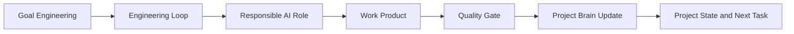

# AI Engineering Operating System

This repository is the operating system for AI-assisted modernization of large
legacy software systems. It defines how AI agents discover goals, reason about
architecture, write and review code, preserve organizational knowledge, and
govern delivery.

The AI-OS is not application code. It is the production handbook that future AI
agents must use before changing application systems.

## Operating Contract

Every engineering task starts with an explicit goal, follows a reusable loop,
complies with the architecture constitution, updates the Project Brain, and
ends with reviewable evidence.

## Non-Negotiable Principles

- Optimize for clear behavior, not clever implementation.
- Prefer simple, cohesive modules with explicit dependencies.
- Keep business rules in the domain model and infrastructure at the edges.
- Use dependency injection, composition, and ports instead of hidden globals.
- Fail fast with actionable errors and observable system behavior.
- Make every trade-off explicit through acceptance criteria, ADRs, or Project
  Brain entries.
- Improve the system when touching it, but do not expand scope without a goal.

## Technology Baseline

The standards target modernization work built with Python 3.13+, FastAPI,
SQLAlchemy 2.x, Pydantic v2, PostgreSQL, Alembic, Redis, AsyncIO, Docker,
Kubernetes, GitHub Actions, pytest, Ruff, and mypy.

The stack is a constraint, not an excuse. Architecture rules still apply when a
framework makes a shortcut convenient.

## Core Documents

- [Architecture Constitution](architecture/constitution.md): mandatory
  architectural rules and exception process.
- [Goal Engineering](goals/goal-engineering.md): how goals are discovered,
  decomposed, measured, accepted, and closed.
- [Engineering Loops](loops/README.md): reusable execution loops for discovery,
  design, implementation, testing, security, performance, documentation,
  review, deployment, and retrospectives.
- [AI Role Model](agents/README.md): responsibilities, authority, outputs,
  escalation rules, and quality gates for AI agents.
- [Project Brain](brain/README.md): persistent knowledge system that stores
  rules, decisions, risks, patterns, lessons, dependencies, debt, and roadmap.
- [Manifest](MANIFEST.md): inventory of documentation domains and ownership.
- [Project State](PROJECT_STATE.md): current phase status and review evidence.
- [Next Task](NEXT_TASK.md): next bounded phase for review and continuation.
- [Changelog](CHANGELOG.md): history of AI-OS changes.

## Required Task Flow

1. Read the relevant Project Brain entries.
2. Define the goal using SMART, CLEAR, constraints, risks, acceptance criteria,
   exit criteria, and success metrics.
3. Select the responsible AI role and the required engineering loop.
4. Produce the smallest complete work product that satisfies the goal.
5. Apply the relevant checklists and quality gates.
6. Update Project Brain, Project State, Manifest, Next Task, and Changelog.
7. Commit and push the completed phase to the configured Git remote.
8. Stop for human review.

## Documentation Standard

Every durable standard must include:

- philosophy and rationale;
- concrete rules;
- good and bad examples;
- decision guidance;
- AI-specific instructions;
- review checklist;
- references or cross-links.

Documents must avoid placeholders, vague aspirations, and duplicated policy.
When a rule belongs elsewhere, link to the source of truth instead of copying it.

## Phase Policy

Work proceeds in bounded phases. A phase is complete only when its documents are
internally consistent, cross-referenced, reflected in the manifest, recorded in
project state, and paired with a specific next task.
