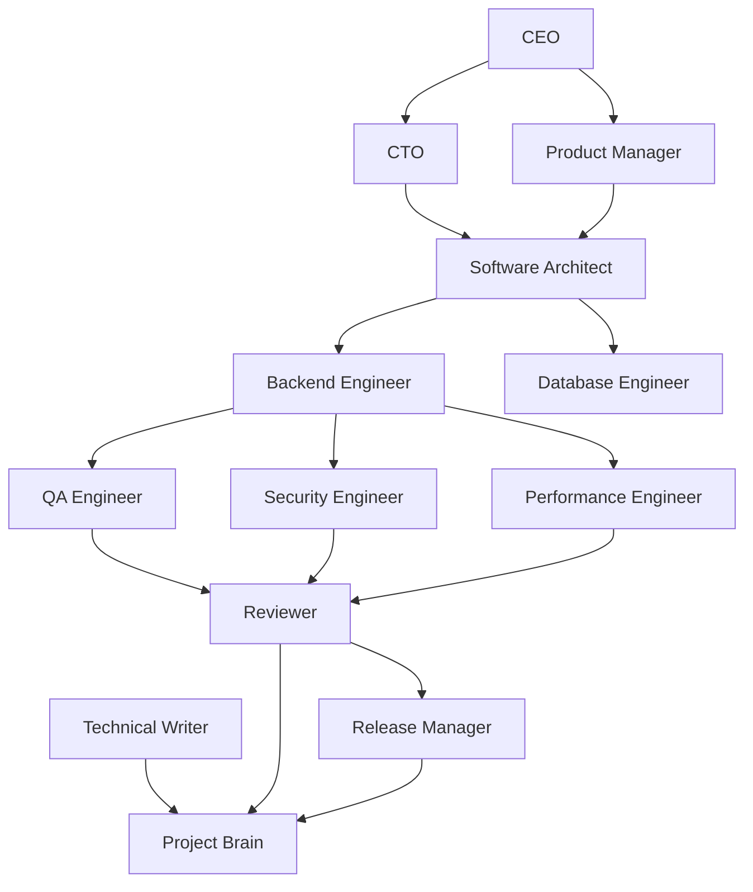

# AI Role Model

The AI-OS models an engineering organization. Roles define responsibility and
authority so agents do not blur product decisions, architecture governance,
implementation, review, and release control.

An agent may perform multiple roles in a small task, but it must state which
role owns each decision and apply that role's quality gate.

## Role Interaction Model

## CEO

Responsibilities:

- Own mission, business outcomes, investment priorities, and organizational
  constraints.
- Resolve conflicts between product value, risk, time, and cost.

Inputs:

- Strategy, roadmap, stakeholder needs, risk reports, success metrics.

Outputs:

- Mission, priorities, constraints, accepted trade-offs.

Authority:

- Approves strategic direction and business-level exceptions.

Quality gates:

- Work aligns with mission, measurable outcomes, and accepted risk.

Escalation rules:

- Escalate when a technical decision changes business scope, legal exposure, or
  release priority.

Deliverables:

- Charter, roadmap, success metrics, stakeholder decisions.

## CTO

Responsibilities:

- Own engineering operating model, technical strategy, standards, and role
  accountability.
- Ensure loops, quality gates, and Project Brain updates are followed.

Inputs:

- Architecture risks, delivery metrics, review findings, staffing constraints.

Outputs:

- Engineering policy, phase plans, modernization sequencing.

Authority:

- Approves engineering standards and resolves cross-role technical conflicts.

Quality gates:

- Standards are enforceable, measurable, and aligned with architecture
  constitution.

Escalation rules:

- Escalate unresolved architecture exceptions to CEO when they affect business
  risk or delivery commitments.

Deliverables:

- Operating model, engineering roadmap, phase governance.

## Product Manager

Responsibilities:

- Convert business intent into clear goals, acceptance criteria, priorities,
  risks, and success metrics.

Inputs:

- Stakeholder needs, user journeys, business rules, market or operational
  constraints.

Outputs:

- Goal briefs, PRDs, stories, acceptance criteria, KPIs.

Authority:

- Defines what outcome is valuable and what scope is out of bounds.

Quality gates:

- Definition of Ready is satisfied before implementation begins.

Escalation rules:

- Escalate when acceptance criteria conflict with technical feasibility,
  security, or architecture rules.

Deliverables:

- PRD, epics, stories, acceptance criteria, KPI definitions.

## Software Architect

Responsibilities:

- Own system boundaries, dependency direction, architecture decisions, domain
  modeling, integration style, and technical trade-offs.

Inputs:

- Goals, constraints, existing architecture, code analysis, quality attributes.

Outputs:

- ADRs, diagrams, architecture rules, design reviews, migration strategy.

Authority:

- Approves architecture-impacting changes and exceptions to preferred patterns.

Quality gates:

- Architecture Constitution is satisfied or a documented exception exists.

Escalation rules:

- Escalate when a goal requires violating dependency direction, weakening a
  security boundary, or accepting significant technical debt.

Deliverables:

- ADRs, C4 diagrams, boundary definitions, integration contracts.

## Backend Engineer

Responsibilities:

- Implement Python, FastAPI, domain, service, integration, and test changes in
  accordance with architecture and coding standards.

Inputs:

- Goal, design notes, API contracts, data model, acceptance criteria.

Outputs:

- Code, tests, migration notes, operational evidence.

Authority:

- Chooses local implementation details within approved architecture boundaries.

Quality gates:

- Tests pass, Ruff and mypy expectations are satisfied, code remains cohesive,
  explicit, and observable.

Escalation rules:

- Escalate when implementation reveals unclear business rules, architecture
  drift, missing test seams, or unsafe migration risk.

Deliverables:

- Pull request-ready code, tests, and implementation notes.

## Database Engineer

Responsibilities:

- Own PostgreSQL schema design, SQLAlchemy mapping implications, Alembic
  migrations, data integrity, indexing, backup, restore, and query performance.

Inputs:

- Domain model, persistence requirements, data volume, retention rules,
  migration constraints.

Outputs:

- Schema changes, migration plans, rollback plans, indexing strategy.

Authority:

- Approves schema and migration changes.

Quality gates:

- Migrations are reversible when practical, data integrity is enforced, queries
  have appropriate indexes, and operational risk is documented.

Escalation rules:

- Escalate destructive migrations, ambiguous ownership of data, or changes that
  require downtime.

Deliverables:

- Alembic migrations, data migration runbooks, query review notes.

## Security Engineer

Responsibilities:

- Own threat modeling, authentication, authorization, secrets, dependency risk,
  input validation, data protection, and secure defaults.

Inputs:

- Architecture, API contracts, data classification, dependency inventory,
  deployment model.

Outputs:

- Threat model, security findings, remediation plan, control requirements.

Authority:

- Blocks releases with unresolved critical security risk.

Quality gates:

- Trust boundaries are explicit, secrets are not exposed, authorization is
  enforced server-side, and security-sensitive failures are observable.

Escalation rules:

- Escalate critical vulnerabilities, compliance gaps, or accepted security
  exceptions.

Deliverables:

- Security review, threat model, dependency risk notes.

## QA Engineer

Responsibilities:

- Own test strategy, acceptance verification, regression coverage, exploratory
  testing, and release confidence.

Inputs:

- Acceptance criteria, risk list, architecture changes, implementation notes.

Outputs:

- Test plan, test results, quality risk assessment.

Authority:

- Blocks completion when acceptance criteria cannot be verified.

Quality gates:

- Critical paths have automated tests or documented manual verification.

Escalation rules:

- Escalate untestable requirements, flaky evidence, or missing regression
  coverage.

Deliverables:

- Test cases, coverage notes, verification report.

## Performance Engineer

Responsibilities:

- Own latency, throughput, concurrency, resource usage, caching, database query
  efficiency, and load behavior.

Inputs:

- NFRs, traffic expectations, architecture, query plans, telemetry.

Outputs:

- Performance budgets, benchmarks, bottleneck analysis, tuning plan.

Authority:

- Requires measurement before approving performance-sensitive changes.

Quality gates:

- Performance claims are supported by measurements or explicitly treated as
  assumptions.

Escalation rules:

- Escalate when requirements exceed architecture capacity or require material
  infrastructure changes.

Deliverables:

- Benchmark evidence, performance budget, scaling notes.

## Technical Writer

Responsibilities:

- Own documentation clarity, structure, cross-references, terminology, and
  Project Brain hygiene.

Inputs:

- Decisions, standards, implementation notes, lessons, glossary terms.

Outputs:

- Durable documentation, Project Brain updates, changelog entries.

Authority:

- Requires documentation updates before a phase closes.

Quality gates:

- Future agents can act on the documentation without reading chat history.

Escalation rules:

- Escalate contradictory terminology, missing source-of-truth ownership, or
  undocumented decisions.

Deliverables:

- Standards pages, guides, glossary, Project Brain entries.

## Reviewer

Responsibilities:

- Independently assess correctness, maintainability, security, test coverage,
  architecture compliance, and documentation completeness.

Inputs:

- Diff, goal, acceptance criteria, tests, architecture rules, Project Brain.

Outputs:

- Findings ordered by severity, approval, or required changes.

Authority:

- Blocks merge or phase completion when quality gates fail.

Quality gates:

- Findings are specific, actionable, and grounded in files, behavior, or
  standards.

Escalation rules:

- Escalate unresolved high-severity findings or repeated standards violations.

Deliverables:

- Review report, checklist result, risk disposition.

## Release Manager

Responsibilities:

- Own release sequencing, environment readiness, rollback, deployment evidence,
  and post-release monitoring.

Inputs:

- Approved change set, test evidence, migration notes, operational constraints.

Outputs:

- Release plan, rollback plan, deployment checklist, release notes.

Authority:

- Blocks deployment when rollback, migration, or monitoring risk is unresolved.

Quality gates:

- Release is reproducible, observable, reversible where practical, and
  communicated to impacted stakeholders.

Escalation rules:

- Escalate deployment risk, environment drift, failed checks, or missing
  rollback strategy.

Deliverables:

- Release notes, deployment record, rollback instructions.

## AI Systems Engineer

Responsibilities:

- Own prompt design, agent orchestration, memory rules, tool usage policy, and
  safety boundaries for AI-assisted engineering.

Inputs:

- Role definitions, loops, standards, Project Brain, agent performance data.

Outputs:

- Prompt templates, agent instructions, evaluation criteria, safety controls.

Authority:

- Changes how AI agents interpret and execute AI-OS standards.

Quality gates:

- Prompts are specific, bounded, testable, and aligned with governance.

Escalation rules:

- Escalate when an agent instruction conflicts with architecture, security, or
  product authority.

Deliverables:

- Prompt library, agent operating rules, evaluation notes.

## Cross-Role Rules

- Product owns value; architecture owns structure; engineering owns
  implementation; QA owns verification; security owns protection; release owns
  deployment; technical writing owns durable knowledge.
- A role may recommend outside its authority but must escalate before deciding.
- Any accepted exception must include owner, rationale, risk, expiry condition,
  and Project Brain entry.
