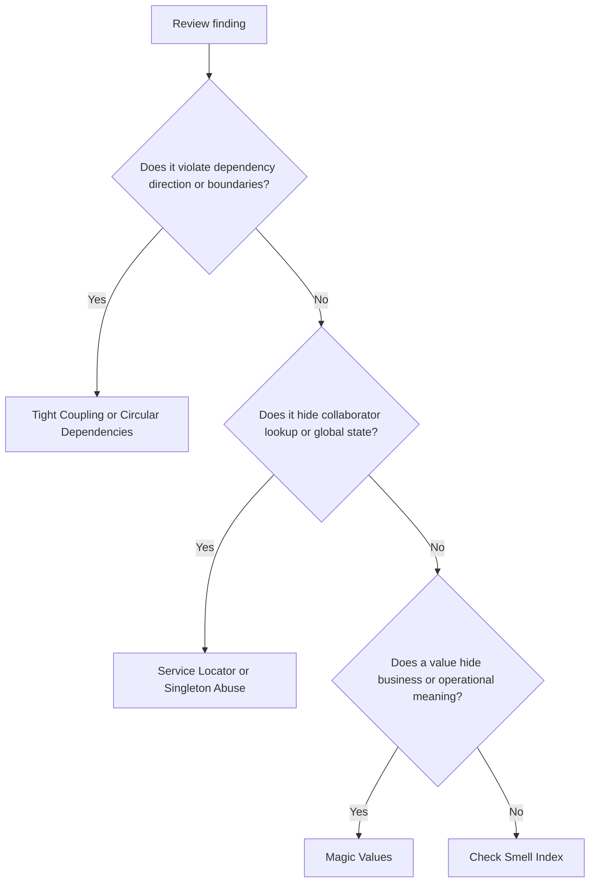

# Anti-Pattern Review Index

Anti-patterns are design choices that repeatedly produce brittle, unsafe, or
unmaintainable systems. In AI-OS work, anti-pattern findings are architecture or
review findings, not style preferences.

## Use This Index

Use this page when reviewing legacy code, planning refactors, or deciding
whether an issue requires architecture escalation.

## Severity Model

| Severity | Meaning | Required Action |
| --- | --- | --- |
| Critical | Creates security exposure, data loss risk, production instability, or blocks required architecture direction. | Block completion until fixed or formally accepted by owner. |
| High | Causes hidden dependencies, unsafe change amplification, or cross-layer violations in active code. | Fix in current phase when in scope; otherwise record debt with owner and trigger. |
| Medium | Creates maintainability risk in a bounded area with clear workaround. | Fix opportunistically or schedule in next relevant phase. |
| Low | Local issue with limited blast radius and no current behavioral risk. | Improve under Boy Scout Rule when touching the area. |

## Completed Anti-Patterns

| Anti-Pattern | Primary Signal | Default Severity | First Response |
| --- | --- | --- | --- |
| [Circular Dependencies](circular-dependencies.md) | Components require each other directly or indirectly. | High | Restore dependency direction with ports, shared concepts, or ownership split. |
| [Service Locator](service-locator.md) | Core logic obtains collaborators from a hidden registry or container. | High | Replace hidden lookup with explicit dependency injection. |
| [Magic Values](magic-values.md) | Literal values carry unexplained policy, unit, status, or configuration meaning. | Medium | Name the concept, use enum/value object/settings, and test thresholds. |
| [Tight Coupling](tight-coupling.md) | Components know volatile internals, lifecycles, or infrastructure details. | High | Introduce stable contracts and move construction to composition roots. |
| [Singleton Abuse](singleton-abuse.md) | Global instance access or mutable process state hides dependencies. | High | Inject dependencies and manage resource lifetime at the edge. |

## Routing Decision Tree

## Review Rules

- Treat active architecture violations as findings even when the legacy system
  has normalized them.
- Do not propose broad rewrites before identifying the owner and boundary that
  should absorb the change.
- If an anti-pattern cannot be fixed safely in the current phase, record debt
  with owner, risk, and repayment trigger.
- Cross-link anti-pattern findings to the relevant Architecture Constitution
  rule.

## AI Guidance

- Classify the anti-pattern before suggesting a refactor.
- Prefer the smallest refactor that restores explicit ownership.
- Do not hide architectural risk behind "existing behavior".
- Escalate critical and high findings when acceptance would change architecture
  policy.

## References

- Architecture Constitution: `../architecture/constitution.md`
- Smell Review Index: `../smells/README.md`
- Architecture Review Checklist: `../checklists/architecture-review.md`
- Code Review Checklist: `../checklists/code-review.md`
