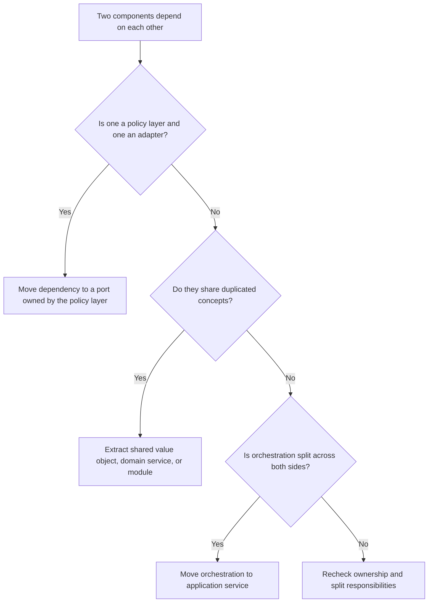

# Circular Dependencies

Circular dependencies happen when two or more modules, packages, classes, or
layers depend on each other directly or indirectly. They are prohibited in
AI-OS-governed systems unless recorded as a temporary architecture exception.

## Philosophy

A dependency graph should explain system direction. Circular dependencies make
direction disappear. They force unrelated code to load together, make tests
fragile, hide ownership, and block incremental modernization because no part can
be changed without pulling the other part with it.

The goal is not to satisfy an import linter for its own sake. The goal is to
preserve clear boundaries and make changes local.

## Explanation

Common circular dependency forms:

- package import cycles, such as `services` importing `repositories` while
  `repositories` imports `services`;
- layer cycles, such as infrastructure calling application services that call
  infrastructure directly;
- domain cycles, such as two aggregates enforcing each other's invariants;
- test cycles, where fixtures import production modules that import test-only
  helpers;
- runtime cycles through registries, callbacks, or service locators even when
  imports look clean.

Circular dependencies violate the Architecture Constitution rule that dependency
direction is inward and boundaries are explicit.

## Bad Example

```python
# app/orders/service.py
from app.billing.service import BillingService


class OrderService:
    def place_order(self, order_id: str) -> None:
        BillingService().charge_for_order(order_id)
```

```python
# app/billing/service.py
from app.orders.service import OrderService


class BillingService:
    def charge_for_order(self, order_id: str) -> None:
        order = OrderService().get_order(order_id)
        self._charge(order)
```

Both services construct each other and neither owns the workflow boundary.

## Good Example

```python
# app/orders/ports.py
from typing import Protocol


class PaymentGateway(Protocol):
    def charge(self, order_id: str, amount_cents: int) -> None: ...
```

```python
# app/orders/service.py
from app.orders.ports import PaymentGateway


class OrderService:
    def __init__(self, payment_gateway: PaymentGateway) -> None:
        self._payment_gateway = payment_gateway

    def place_order(self, order_id: str, amount_cents: int) -> None:
        self._payment_gateway.charge(order_id, amount_cents)
```

```python
# app/billing/adapter.py
from app.orders.ports import PaymentGateway


class BillingPaymentGateway(PaymentGateway):
    def charge(self, order_id: str, amount_cents: int) -> None:
        ...
```

The application workflow depends on a port. Billing implements the port at the
edge.

## Decision Tree



## Refactoring Strategies

- Extract a protocol or port in the inner layer and move the implementation to
  the outer layer.
- Move workflow orchestration into an application service.
- Extract shared concepts into a lower-level module with no dependency on either
  caller.
- Replace import-time registration with explicit dependency injection.
- Split broad modules by responsibility before adding abstractions.
- Use domain events when one aggregate must notify another without direct
  control flow.

## AI Guidance

- Inspect imports and runtime dependency creation before changing architecture.
- Do not "fix" cycles by moving imports inside functions unless the cycle is
  purely incidental and the architecture remains valid.
- Prefer naming the owning direction first, then changing code.
- When a cycle cannot be removed in one phase, isolate it, document the risk in
  Project Brain, and add a repayment trigger.

## Review Checklist

- No package or layer import cycle remains in the changed area.
- Domain code does not import infrastructure, FastAPI, SQLAlchemy sessions, or
  external clients.
- Shared code is cohesive and lower level than the callers.
- Ports are owned by the policy layer that needs them.
- Tests verify behavior through explicit dependencies.
- Any temporary cycle has an owner, risk, and expiry condition.

## References

- Architecture Constitution: `../architecture/constitution.md`
- Dependency Injection: `../engineering/dependency-injection.md`
- High Cohesion and Low Coupling: `../engineering/high-cohesion-low-coupling.md`
- Hexagonal Architecture: `../architecture/hexagonal.md`
