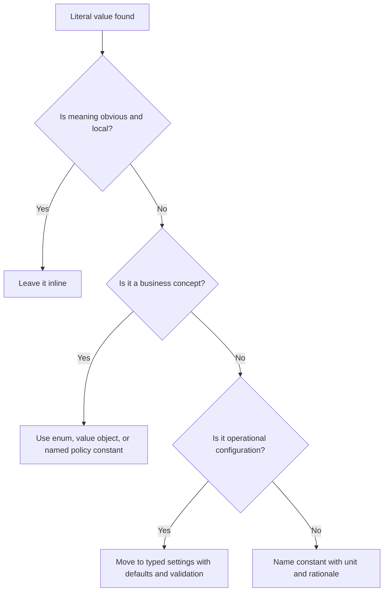

# Magic Values

Magic values are unexplained literals embedded in code or configuration where
the meaning, unit, source, or change process is unclear.

## Philosophy

Numbers and strings are not bad. Unnamed business meaning is bad. A value is
magic when a future engineer or AI agent cannot safely answer why it exists,
what it represents, and whether changing it is allowed.

The goal is explicit intent, not replacing every literal with a constant.

## Explanation

Magic values commonly include:

- status strings such as `"P"`, `"A"`, or `"done"`;
- timeouts without units;
- retry counts without rationale;
- role names and permission strings scattered across endpoints;
- currency thresholds;
- pagination defaults;
- cron expressions;
- environment variable names;
- SQL fragments and column aliases;
- HTTP status codes used without context.

Acceptable literals include obvious local values such as `0`, `1`, `True`,
empty containers, and short strings in tests when their meaning is asserted by
the test name.

## Bad Example

```python
async def list_jobs(limit: int = 100):
    if limit > 500:
        raise ValueError("too many")
    return await repository.fetch(status="R", timeout=30)
```

The reader does not know what `500`, `"R"`, or `30` mean.

## Good Example

```python
from enum import StrEnum


DEFAULT_JOB_PAGE_SIZE = 100
MAX_JOB_PAGE_SIZE = 500
JOB_QUERY_TIMEOUT_SECONDS = 30


class JobStatus(StrEnum):
    RUNNING = "R"


async def list_jobs(limit: int = DEFAULT_JOB_PAGE_SIZE):
    if limit > MAX_JOB_PAGE_SIZE:
        raise ValueError("limit exceeds maximum job page size")
    return await repository.fetch(
        status=JobStatus.RUNNING,
        timeout_seconds=JOB_QUERY_TIMEOUT_SECONDS,
    )
```

The values now have names, units, and business meaning.

## Decision Tree



## Refactoring Strategies

- Replace status strings with `StrEnum` or domain value objects.
- Name numeric constants with units, such as `_SECONDS`, `_BYTES`, or `_CENTS`.
- Move deploy-time values into typed Pydantic settings.
- Centralize shared permission names, event names, and queue names.
- Keep constants close to their owner unless they are used across bounded
  contexts.
- Add tests for policy thresholds when behavior depends on them.

## AI Guidance

- Do not create a global `constants.py` dumping ground. Put values near the
  policy that owns them.
- Preserve wire values when replacing strings with enums.
- Ask whether a value is business policy, technical configuration, or local
  implementation detail before moving it.
- Record important thresholds and policy values in Project Brain when they
  represent business rules.

## Review Checklist

- Important literals have names that reveal meaning and units.
- Business statuses and categories use enums or value objects.
- Operational values are typed and validated.
- Constants are owned by the relevant module or bounded context.
- Tests cover behavior at threshold boundaries.
- No unrelated values were centralized into a low-cohesion constants module.

## References

- Goal Engineering: `../goals/goal-engineering.md`
- Pydantic v2: `../python/pydantic-v2.md`
- Primitive Obsession: `../smells/primitive-obsession.md`
- KISS: `../engineering/kiss.md`
