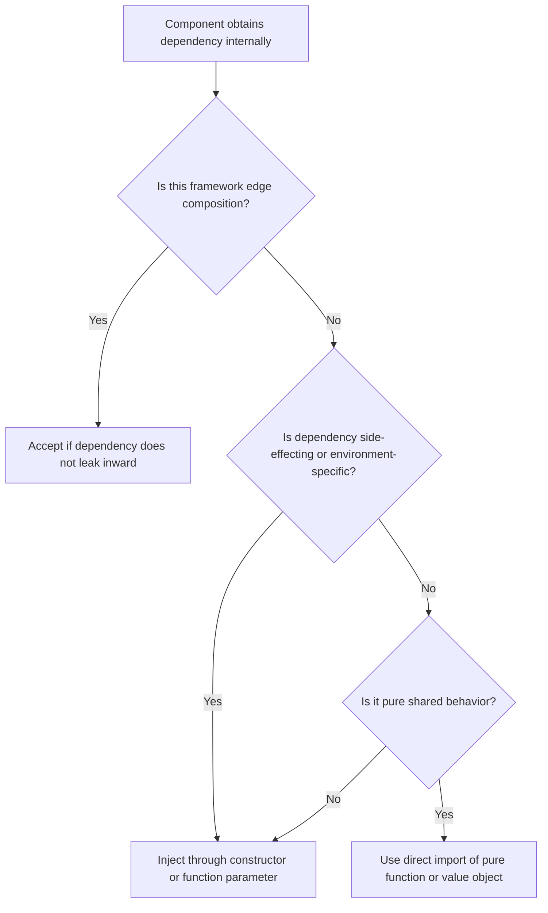

# Service Locator

The Service Locator anti-pattern hides dependencies behind a global registry,
container, module-level getter, or framework lookup. It is prohibited for core
application and domain logic.

## Philosophy

Dependencies are part of a component's contract. If a class or function needs a
database, clock, HTTP client, message publisher, cache, or feature flag service,
the caller should see that dependency explicitly. Hidden lookup makes code look
simple while moving complexity into runtime state.

Dependency injection is preferred because it makes behavior testable, auditable,
and replaceable.

## Explanation

Service Locator often appears as:

- `container.get("user_service")`;
- module-level `get_db()` or `get_settings()` inside business logic;
- global registries populated during startup;
- framework dependency lookups used outside framework edges;
- singleton accessors such as `Config.current()` or `Logger.instance()`.

FastAPI dependency functions are acceptable at the HTTP boundary. They become a
problem when domain or application services call the framework to locate their
own collaborators.

## Bad Example

```python
class InvoiceService:
    def issue_invoice(self, customer_id: str) -> None:
        repository = container.get("invoice_repository")
        clock = container.get("clock")
        repository.save(customer_id, issued_at=clock.utcnow())
```

The constructor lies: `InvoiceService` appears dependency-free, but it requires
container configuration and hidden runtime state.

## Good Example

```python
from datetime import datetime
from typing import Protocol


class Clock(Protocol):
    def utcnow(self) -> datetime: ...


class InvoiceRepository(Protocol):
    def save(self, customer_id: str, issued_at: datetime) -> None: ...


class InvoiceService:
    def __init__(self, repository: InvoiceRepository, clock: Clock) -> None:
        self._repository = repository
        self._clock = clock

    def issue_invoice(self, customer_id: str) -> None:
        self._repository.save(customer_id, issued_at=self._clock.utcnow())
```

FastAPI may assemble this service at the edge:

```python
def get_invoice_service() -> InvoiceService:
    return InvoiceService(repository=get_invoice_repository(), clock=SystemClock())
```

## Decision Tree



## Refactoring Strategies

- Add constructor parameters for required collaborators.
- Define protocols for side-effecting dependencies.
- Keep container or FastAPI dependency wiring in composition roots.
- Replace global configuration calls with typed settings passed at startup.
- Replace hidden clocks, randomness, and ID generation with injected providers.
- Update tests to pass fakes instead of patching global registries.

## AI Guidance

- Treat global lookup as a boundary smell even when tests can patch it.
- Do not replace one service locator with another container abstraction.
- Keep framework dependency functions in routers, workers, CLI entrypoints, or
  startup wiring.
- If constructor injection becomes unwieldy, split the class by responsibility
  before adding a locator.

## Review Checklist

- Business logic declares all side-effecting dependencies explicitly.
- Domain and application services do not call container lookup functions.
- FastAPI dependencies are limited to HTTP composition and do not leak inward.
- Tests use fakes or stubs passed explicitly.
- Settings, clocks, random generators, and clients are visible dependencies.
- No module-level mutable registry is required for normal behavior.

## References

- Architecture Constitution: `../architecture/constitution.md`
- Dependency Injection: `../engineering/dependency-injection.md`
- Explicit over Implicit: `../README.md`
- Hidden Side Effects: `../smells/hidden-side-effects.md`
