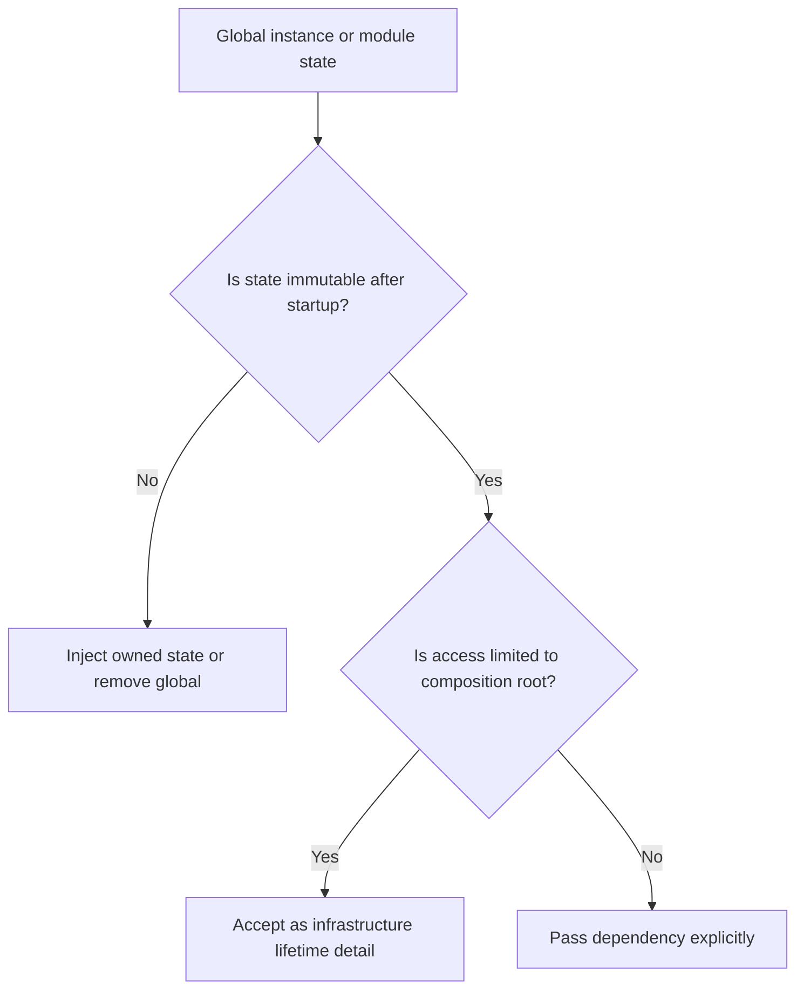

# Singleton Abuse

Singleton abuse occurs when global instance access, module-level mutable state,
or enforced single-instance classes are used to avoid explicit dependency
management.

## Philosophy

Some resources are naturally process-wide at runtime: logging configuration,
connection pools, metrics exporters, and application settings. That does not
mean business logic should fetch them globally. A singleton is acceptable only
when lifetime is an infrastructure concern and callers still receive explicit
dependencies.

Global state turns tests order-dependent, hides behavior, and creates production
surprises under concurrency.

## Explanation

Common forms:

- `Database.instance()`;
- `Settings.current()`;
- module-level clients created at import time;
- mutable caches shared across requests without ownership;
- "manager" classes with global accessors;
- singleton wrappers used as service locators.

In async Python and FastAPI, singleton abuse often causes event loop leakage,
unsafe connection reuse, and hard-to-reset state in tests.

## Bad Example

```python
class Settings:
    _instance: "Settings | None" = None

    @classmethod
    def current(cls) -> "Settings":
        if cls._instance is None:
            cls._instance = Settings.from_environment()
        return cls._instance


class BackupService:
    def run(self) -> None:
        bucket = Settings.current().backup_bucket
        ...
```

`BackupService` depends on environment state without declaring it.

## Good Example

```python
from pydantic import BaseModel


class BackupSettings(BaseModel):
    backup_bucket: str


class BackupService:
    def __init__(self, settings: BackupSettings, storage: StorageGateway) -> None:
        self._settings = settings
        self._storage = storage

    def run(self) -> None:
        self._storage.write(self._settings.backup_bucket)
```

The process may create one settings object at startup, but the service receives
it explicitly.

## Decision Tree



## Refactoring Strategies

- Replace singleton accessors with constructor injection.
- Create clients in application startup and pass them through dependency wiring.
- Wrap mutable caches behind explicit cache interfaces with ownership rules.
- Provide test fakes instead of reset hooks for global state.
- Keep process-wide objects in composition roots, not domain or application
  logic.
- Use context managers or lifespan hooks for resources requiring cleanup.

## AI Guidance

- Do not introduce singleton classes to avoid passing parameters.
- In FastAPI, prefer lifespan-managed resources plus dependency providers at the
  edge.
- Treat mutable module state as concurrency-sensitive until proven otherwise.
- If a singleton is retained temporarily, document reset behavior and repayment
  trigger in Project Brain.

## Review Checklist

- Core logic does not call global instance accessors.
- Runtime resources have explicit lifetime management.
- Tests do not rely on global reset ordering.
- Async resources are tied to the correct event loop and lifespan.
- Mutable shared state has an owner and concurrency policy.
- Any remaining singleton is immutable, infrastructure-owned, and justified.

## References

- Architecture Constitution: `../architecture/constitution.md`
- Service Locator: `service-locator.md`
- Dependency Injection: `../engineering/dependency-injection.md`
- Async Standards: `../python/async.md`
