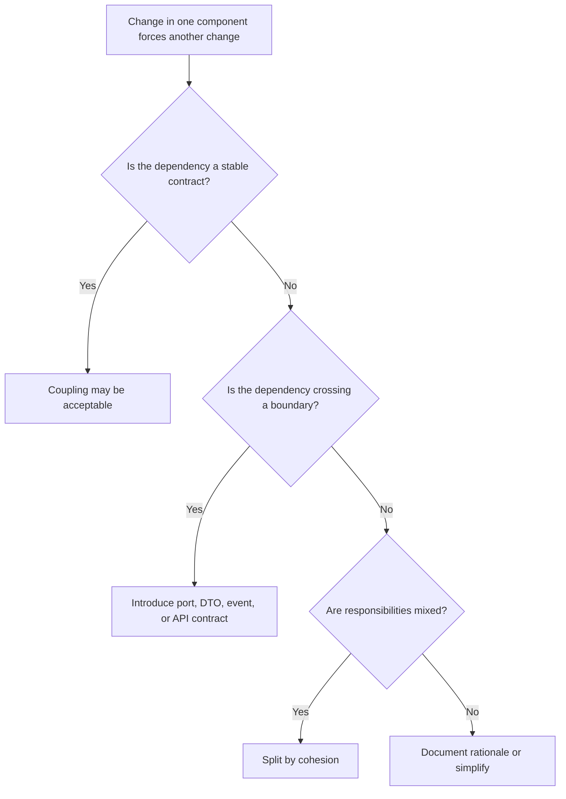

# Tight Coupling

Tight coupling exists when a component knows too much about another component's
implementation, lifecycle, data model, framework, or failure behavior. It is a
primary modernization risk.

## Philosophy

Coupling is not always bad. Software components must collaborate. Coupling
becomes harmful when a change in one place forces unnecessary changes in many
others, or when a component cannot be tested, deployed, or reasoned about
without its neighbors.

AI agents must reduce harmful coupling by clarifying ownership and preserving
useful cohesion.

## Explanation

Tight coupling appears as:

- routers constructing repositories and external clients directly;
- domain objects depending on ORM sessions;
- services reading each other's internal attributes;
- shared mutable objects passed through many layers;
- tests requiring real databases for pure business logic;
- direct imports across bounded contexts;
- one module knowing another module's SQL table structure;
- exception types from infrastructure leaking into domain or API contracts.

## Bad Example

```python
class UserReportService:
    def build_report(self, user_id: str) -> dict:
        session = SessionLocal()
        rows = session.execute(
            text("select * from users join invoices on invoices.user_id = users.id")
        )
        return ExternalPdfClient("https://pdf.example.com").render(rows)
```

This service is coupled to session creation, SQL structure, external client
construction, and output format.

## Good Example

```python
class UserReportService:
    def __init__(
        self,
        users: UserRepository,
        invoices: InvoiceRepository,
        renderer: ReportRenderer,
    ) -> None:
        self._users = users
        self._invoices = invoices
        self._renderer = renderer

    def build_report(self, user_id: str) -> bytes:
        user = self._users.get(user_id)
        invoices = self._invoices.list_for_user(user_id)
        return self._renderer.render_user_report(user, invoices)
```

The service is coupled to explicit contracts, not hidden implementation details.

## Decision Tree



## Refactoring Strategies

- Introduce ports for external systems and infrastructure.
- Move object construction to composition roots.
- Replace cross-context imports with API calls, events, or published contracts.
- Hide persistence details behind repositories when domain behavior matters.
- Convert broad shared utilities into cohesive domain-specific helpers.
- Replace exception leakage with application-level error types.

## AI Guidance

- Measure coupling by change impact, not only import count.
- Do not add interfaces for every class. Add boundaries where volatility or
  side effects justify them.
- Prefer vertical slices with clear contracts over horizontal utility layers.
- When reducing coupling, preserve behavior first and improve structure in
  reviewable steps.

## Review Checklist

- Components depend on stable contracts, not volatile internals.
- Domain logic is independent of framework and persistence details.
- Object construction is separated from business behavior.
- Cross-context communication uses explicit contracts.
- Tests can exercise business behavior without full infrastructure.
- The refactor reduced change amplification instead of adding ceremony.

## References

- Architecture Constitution: `../architecture/constitution.md`
- High Cohesion and Low Coupling: `../engineering/high-cohesion-low-coupling.md`
- Law of Demeter: `../engineering/law-of-demeter.md`
- Circular Dependencies: `circular-dependencies.md`
