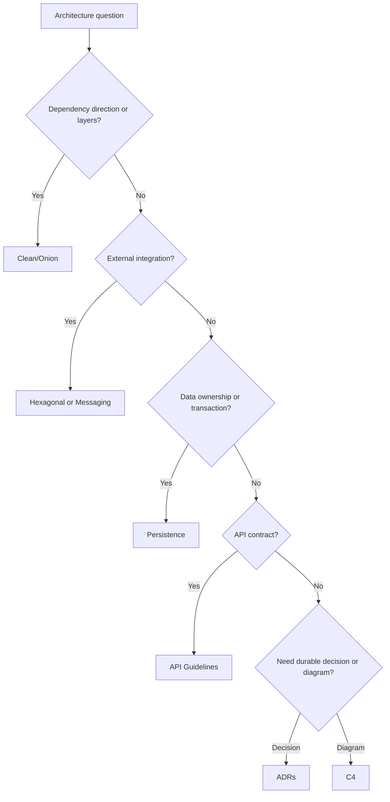

# Architecture Standards Index

Architecture standards govern structural decisions that shape system boundaries,
dependency direction, integration, data ownership, and operational behavior.

## Use This Index

Use this page when a change affects boundaries, layers, APIs, persistence,
async work, messaging, diagrams, or durable decisions.

## Severity Model

| Severity | Meaning | Required Action |
| --- | --- | --- |
| Critical | Violates the Architecture Constitution, creates data loss/security risk, or blocks safe deployment. | Block completion or require formal exception. |
| High | Introduces hidden coupling, dependency inversion failure, unsafe persistence, or unowned integration. | Fix in phase or record owned debt. |
| Medium | Reduces clarity or consistency in a bounded area. | Fix opportunistically or schedule follow-up. |
| Low | Local naming, diagram, or documentation inconsistency. | Improve when touching the area. |

## Standards Catalog

| Standard | Use When | Common Findings |
| --- | --- | --- |
| [Clean Architecture](clean-architecture.md) | Defining dependency direction and layers. | Framework logic in domain |
| [Hexagonal Architecture](hexagonal.md) | Isolating external systems behind ports/adapters. | Direct client calls in core |
| [Onion Architecture](onion.md) | Protecting domain core through concentric layers. | Inward dependency violations |
| [Persistence](persistence.md) | Designing data access, repositories, transactions, migrations. | ORM leakage, unsafe migrations |
| [API Guidelines](api-guidelines.md) | Designing stable HTTP/API contracts. | Leaked internals, weak compatibility |
| [Async Architecture](async.md) | Designing async workflows and concurrency. | Blocking I/O, unbounded tasks |
| [Messaging](messaging.md) | Events, queues, and asynchronous integrations. | Unowned schemas, unreliable delivery |
| [C4](c4.md) | Communicating architecture diagrams. | Diagrams too detailed or stale |
| [ADRs](adrs.md) | Recording durable decisions. | Undocumented trade-offs |

## Routing Decision Tree

## AI Guidance

- Start from the Architecture Constitution.
- Choose the smallest architecture move that restores direction and ownership.
- Record durable trade-offs in ADRs.
- Keep diagrams useful, not decorative.

## References

- Constitution: `constitution.md`
- Architecture Review: `../checklists/architecture-review.md`
- Engineering Principles: `../engineering/README.md`
- Domain Standards: `../domain/README.md`
