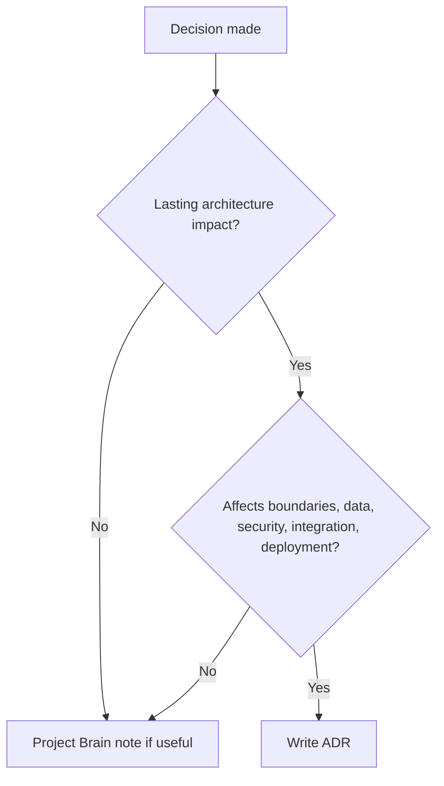

# Architecture Decision Records

Architecture Decision Records capture durable architecture choices, alternatives,
trade-offs, and consequences.

## Philosophy

Future agents should not reconstruct architecture intent from chat history or
diffs. ADRs preserve why a decision was made, what alternatives were rejected,
and when the decision should be revisited.

## Rules

- Write an ADR for lasting architecture decisions.
- Include context, decision, alternatives, consequences, status, owner, and
  review trigger.
- Link related standards, Project Brain entries, and diagrams.
- Mark superseded decisions instead of deleting history.
- Use concise records; avoid essays.

## ADR Template

```markdown
# ADR-000N: Title

- Status: Proposed | Accepted | Superseded
- Date: YYYY-MM-DD
- Owner: Role

## Context

## Decision

## Alternatives Considered

## Consequences

## Review Trigger
```

## Decision Tree



## AI Guidance

- Do not use ADRs for every small implementation detail.
- Record rejected options and trade-offs.
- Keep status current when decisions change.

## Review Checklist

- Decision scope is clear.
- Alternatives and consequences are recorded.
- Owner and review trigger exist.
- Related standards are linked.
- Superseded decisions remain traceable.

## References

- Project Brain: `../brain/README.md`
- Architecture Constitution: `constitution.md`
- C4 Diagrams: `c4.md`
