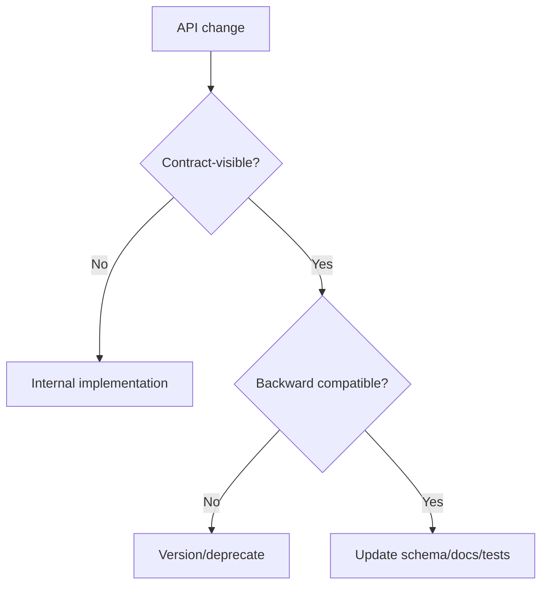

# API Architecture Guidelines

API architecture defines stable contracts between clients and services.

## Philosophy

APIs are product and integration commitments. They must be predictable, secure,
documented, versioned when needed, and independent of internal implementation
shape.

## Rules

- Use explicit request and response schemas.
- Keep error shapes consistent.
- Do not leak ORM models, internal exceptions, stack traces, or secrets.
- Apply authentication and authorization server-side.
- Define pagination and filtering for collections.
- Document compatibility and versioning expectations.

## Bad Example

```python
return job_record.__dict__
```

## Good Example

```python
return JobResponse.from_result(result)
```

## Decision Tree



## AI Guidance

- Treat response shape changes as compatibility risk.
- Keep API contracts decoupled from persistence.
- Update OpenAPI and tests with contract changes.

## Review Checklist

- Schemas are explicit.
- Errors and status codes are consistent.
- Auth and authorization are enforced.
- Collections are bounded.
- Compatibility impact is documented.

## References

- FastAPI Standards: `../fastapi/README.md`
- Pydantic v2: `../python/pydantic-v2.md`
- Versioning: `../fastapi/versioning.md`
