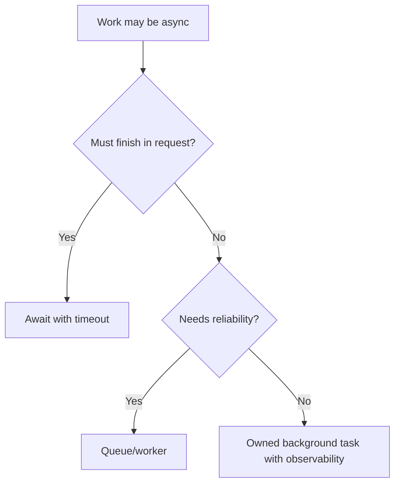

# Async Architecture

Async architecture defines how services use concurrency, background work, and
non-blocking I/O safely.

## Philosophy

Async is an architecture choice, not a keyword. It affects capacity, failure
handling, resource lifetimes, cancellation, observability, and tests.

## Rules

- Do not hide blocking I/O in async paths.
- Bound concurrency and task creation.
- Define timeouts and cancellation behavior.
- Keep background tasks owned and observable.
- Use queues or workers when work outlives request scope.
- Document transaction and resource lifetimes.

## Bad Example

```python
async def route():
    create_task(run_backup())  # no owner, no tracking, no error handling
```

## Good Example

```python
await dispatcher.enqueue_backup(command)
```

## Decision Tree



## AI Guidance

- Design ownership before spawning tasks.
- Prefer explicit queues for durable work.
- Test timeout and failure behavior.

## Review Checklist

- Blocking I/O is isolated.
- Concurrency is bounded.
- Background work has owner and observability.
- Timeouts and retries are defined.
- Tests cover important async failures.

## References

- AsyncIO: `../python/async.md`
- Messaging: `messaging.md`
- DevOps Agent: `../agents/devops.md`
