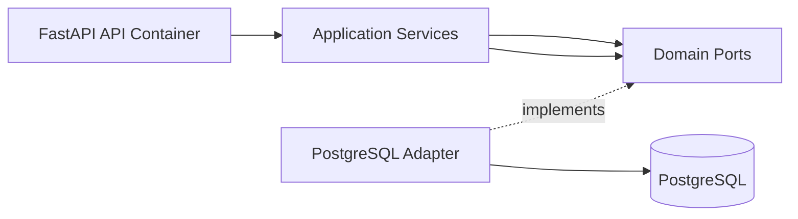
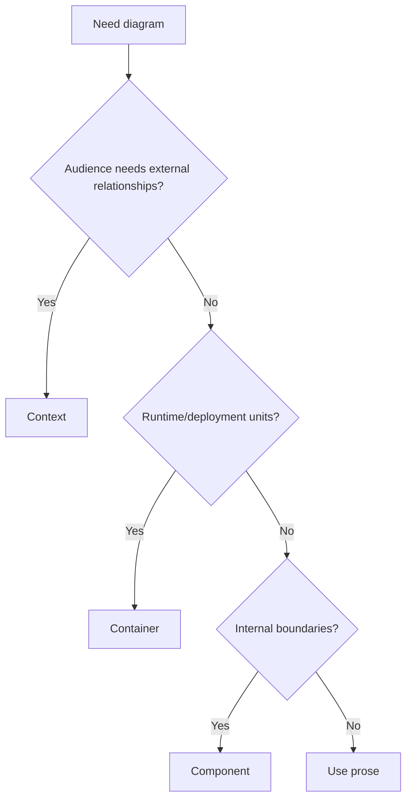

# C4 Diagrams

C4 diagrams communicate architecture at context, container, component, and code
levels.

## Philosophy

Diagrams should answer real questions. A useful diagram clarifies boundaries,
dependencies, ownership, and runtime relationships. Decorative diagrams become
stale noise.

## Rules

- Use Context diagrams for system relationships.
- Use Container diagrams for deployable/runtime units.
- Use Component diagrams for important internal boundaries.
- Use Code diagrams sparingly when text and code are insufficient.
- Include ownership, direction, and external systems.
- Update diagrams when decisions change.

## Bad Example

Too vague to guide decisions.

## Good Example

## Decision Tree

## AI Guidance

- Prefer small diagrams with clear labels.
- Do not diagram every class.
- Keep Mermaid diagrams versioned with the docs they explain.

## Review Checklist

- Diagram answers a specific question.
- Boundaries and dependency directions are visible.
- External systems are labeled.
- Diagram matches current architecture.
- Stale diagrams are removed or updated.

## References

- Architecture Review: `../checklists/architecture-review.md`
- Clean Architecture: `clean-architecture.md`
- ADRs: `adrs.md`
