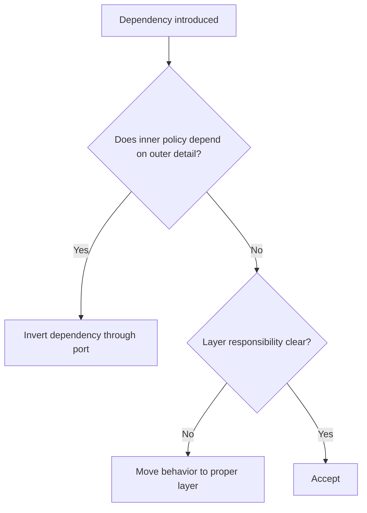

# Clean Architecture

Clean Architecture separates business policy from frameworks, databases, user
interfaces, and external systems.

## Philosophy

The domain and application core should be independently testable and stable.
Frameworks are tools at the edge, not the center of the design.

## Rules

- Dependency direction points inward.
- Domain code does not import FastAPI, SQLAlchemy sessions, Redis, HTTP clients,
  environment variables, or framework lifecycle.
- Application services orchestrate use cases and depend on ports.
- Infrastructure implements ports.
- Transport adapters map external requests and responses.

## Bad Example

```python
class BackupPolicy:
    def can_run(self, request: Request, session: Session) -> bool:
        ...
```

The policy depends on HTTP and persistence.

## Good Example

```python
class RunBackupService:
    def __init__(self, backups: BackupRepository) -> None:
        self._backups = backups
```

The use case depends on a domain-oriented contract.

## Decision Tree



## AI Guidance

- Draw the dependency direction before refactoring.
- Do not use framework convenience to bypass boundaries.
- Keep application services thin but meaningful.

## Review Checklist

- Domain and application layers are framework-independent.
- Ports are owned by inner policy.
- Infrastructure details stay at edges.
- Tests can exercise core behavior without web/database setup.
- Exceptions are documented.

## References

- Constitution: `constitution.md`
- Hexagonal Architecture: `hexagonal.md`
- Dependency Injection: `../engineering/dependency-injection.md`
