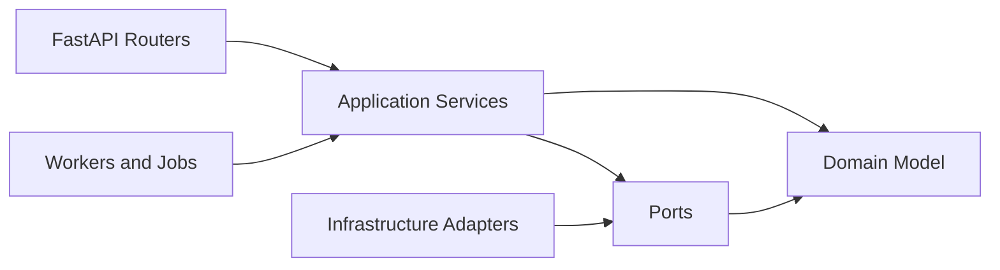
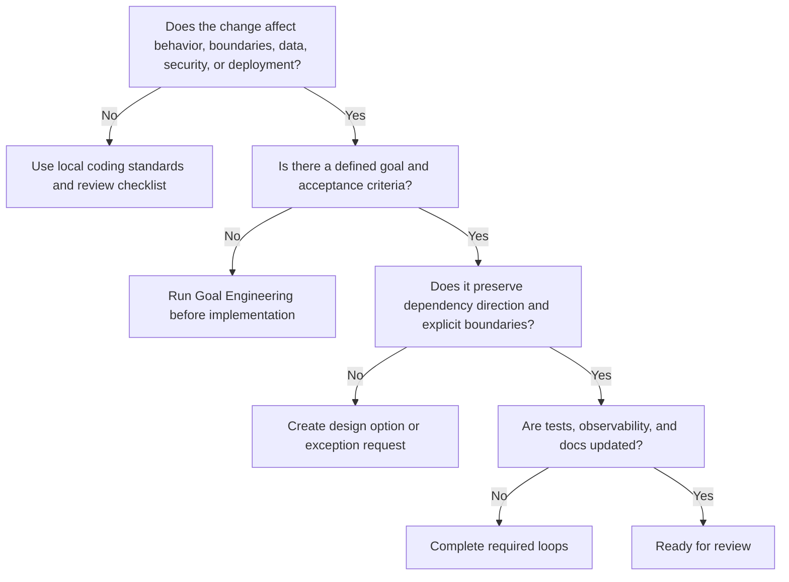

# Architecture Constitution

The Architecture Constitution defines the non-negotiable rules for systems
modernized under this AI Engineering Operating System. Every AI agent must apply
these rules before proposing, implementing, reviewing, or approving changes.

## Purpose

The constitution prevents modernization work from reproducing legacy failure
modes under newer tooling. Frameworks can accelerate delivery, but they do not
replace architecture.

## Scope

These rules apply to Python 3.13+, FastAPI, SQLAlchemy 2.x, Pydantic v2,
PostgreSQL, Alembic, Redis, AsyncIO, Docker, Kubernetes, GitHub Actions, pytest,
Ruff, and mypy projects governed by the AI-OS.

## Constitutional Rules

### 1. Goals Before Changes

No implementation begins without a goal, constraints, risks, acceptance
criteria, exit criteria, and success metrics.

Rationale: Legacy modernization fails when agents optimize local code without
knowing the intended business or operational outcome.

Exception: Emergency production mitigation may start with a short incident goal,
but the full goal record must be completed before closure.

### 2. Dependency Direction Is Inward

Domain logic must not depend on frameworks, databases, message brokers, HTTP
transport, environment variables, or external services. Dependencies point from
outer layers toward inner policy.

Preferred direction:

Rationale: Domain behavior must remain testable and portable while frameworks
remain replaceable at system edges.

Exception: Pure data types from the Python standard library are allowed in the
domain. Framework-specific convenience types are not.

### 3. Business Rules Live in the Domain or Application Layer

Business rules belong in domain entities, value objects, domain services, or
application services. They do not belong in routers, ORM models, migrations,
templates, background scheduler glue, or test fixtures.

Rationale: Scattered business logic creates hidden behavior, duplicate rules,
and unsafe changes.

### 4. Boundaries Must Be Explicit

Every external dependency must be represented by an explicit port, interface,
repository, gateway, or adapter boundary. Hidden calls to remote systems,
filesystem state, environment variables, clocks, randomness, or global
configuration are prohibited in core logic.

Rationale: Explicit boundaries support testing, observability, failure handling,
and replacement.

### 5. Dependency Injection Is Mandatory for Side Effects

Side-effecting collaborators are passed in through constructors, functions, or
framework dependency wiring. Service locators, module-level mutable singletons,
and implicit global registries are prohibited.

Rationale: Hidden dependency resolution makes behavior hard to test, reason
about, and secure.

### 6. Persistence Is an Implementation Detail

SQLAlchemy models and PostgreSQL schemas must protect data integrity, but they
must not become the domain model by accident. Repositories or unit-of-work
patterns mediate persistence concerns where domain behavior matters.

Rationale: ORM convenience often leads to an anemic domain model, transaction
leakage, and persistence-driven architecture.

### 7. APIs Are Contracts

FastAPI endpoints must expose stable, documented contracts using Pydantic v2
request and response models. Do not leak ORM models, internal exceptions, stack
traces, secrets, or infrastructure details through APIs.

Rationale: API contracts are integration boundaries and must remain predictable.

### 8. Async Must Be Honest

AsyncIO code must not hide blocking I/O inside async functions. Blocking
libraries require isolation, executor usage, replacement, or explicit
architecture acceptance.

Rationale: False async causes production latency spikes and capacity failures.

### 9. Migrations Must Be Operationally Safe

Alembic migrations require forward plan, rollback or mitigation plan, data
integrity checks, and deployment sequencing. Destructive migrations require
explicit approval from the Database Engineer and Release Manager roles.

Rationale: Schema changes are production operations, not just code changes.

### 10. Security Is Designed In

Authentication, authorization, input validation, secret handling, audit logging,
and data protection are design concerns. They cannot be deferred to final review.

Rationale: Security issues are often architectural and expensive to retrofit.

### 11. Observability Is Required for Important Behavior

Critical workflows must produce structured logs, metrics, traces, or audit
events sufficient to diagnose failure without exposing sensitive data.

Rationale: Unobservable systems are operationally unsafe.

### 12. Tests Prove Behavior, Not Implementation Trivia

Tests must cover domain rules, application workflows, API contracts, persistence
behavior, and important failure modes. Avoid tests that only freeze incidental
implementation structure.

Rationale: Modernization needs confidence to change internals while preserving
behavior.

### 13. Simplicity Wins Unless Evidence Says Otherwise

Apply KISS and YAGNI. Do not introduce frameworks, abstractions, generic
plug-in systems, caches, queues, inheritance hierarchies, or distributed
components without a documented need.

Rationale: Legacy systems commonly suffer from accidental complexity. AI agents
must not amplify it.

### 14. Exceptions Expire

Any exception to this constitution must include owner, rationale, risk, expiry
condition, and Project Brain entry.

Rationale: Permanent undocumented exceptions become the next legacy system.

## Decision Tree

## Review Checklist

- Goal and acceptance criteria are explicit.
- Domain logic is isolated from frameworks and infrastructure.
- Dependencies point inward.
- Side effects are injected and testable.
- API contracts do not leak internals.
- Database changes are safe and reviewed.
- Security controls are designed, not deferred.
- Blocking I/O is not hidden in async paths.
- Important behavior is observable.
- Tests verify meaningful behavior and failure modes.
- Project Brain and ADRs are updated where needed.

## AI Guidance

- Refuse to implement architecture-impacting work without a goal.
- Prefer smaller changes that improve boundaries over broad rewrites.
- When legacy code violates the constitution, isolate the violation, document
  the risk, and move toward compliance incrementally.
- Do not create an exception silently. Escalate it through the relevant role and
  record it in Project Brain.

## References

- Goal Engineering: `../goals/goal-engineering.md`
- Engineering Loops: `../loops/README.md`
- AI Role Model: `../agents/README.md`
- Project Brain: `../brain/README.md`
- Clean Architecture: `clean-architecture.md`
- Hexagonal Architecture: `hexagonal.md`
- Dependency Injection: `../engineering/dependency-injection.md`
