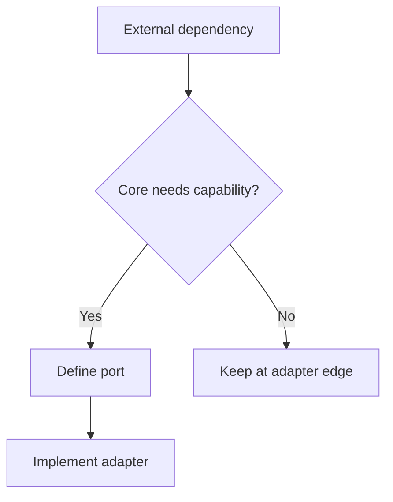

# Hexagonal Architecture

Hexagonal Architecture organizes systems around a core application with ports
and adapters for external interaction.

## Philosophy

External systems change. The application core should talk to stable ports, while
adapters handle HTTP, databases, queues, files, and third-party APIs.

## Rules

- Define ports for capabilities the core needs.
- Implement adapters outside the core.
- Keep adapter errors translated at boundaries.
- Test core behavior with fakes.
- Do not let adapters call back into each other through hidden globals.

## Bad Example

```python
class BackupService:
    def run(self) -> None:
        boto3.client("s3").put_object(...)
```

## Good Example

```python
class BackupStorage(Protocol):
    async def store(self, artifact: BackupArtifact) -> StoredArtifact: ...
```

## Decision Tree



## AI Guidance

- Name ports by domain capability, not vendor.
- Keep adapters boring and replaceable.
- Avoid ports for pure local functions.

## Review Checklist

- Core depends on ports, not vendors.
- Adapters own vendor/client details.
- Tests can fake ports.
- Errors are translated.
- Resource lifetimes are explicit.

## References

- Clean Architecture: `clean-architecture.md`
- Dependency Injection: `../engineering/dependency-injection.md`
- Tight Coupling: `../anti-patterns/tight-coupling.md`
