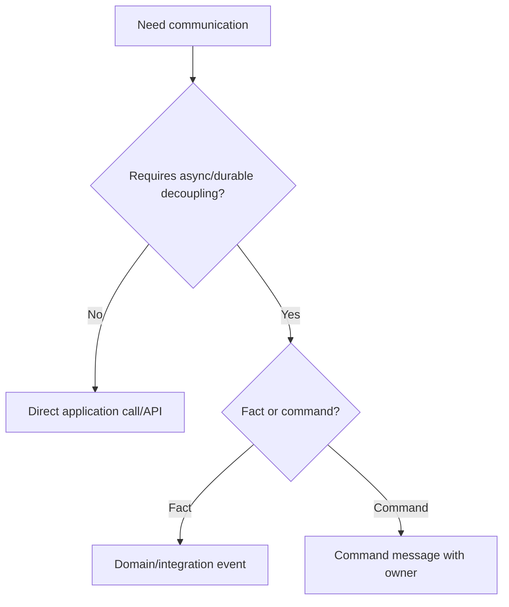

# Messaging Architecture

Messaging architecture governs events, queues, commands, and asynchronous
integration between components or services.

## Philosophy

Messaging decouples producers from consumers, but it also introduces delivery,
ordering, idempotency, observability, and schema evolution concerns.

## Rules

- Choose messages for real decoupling, durability, or asynchronous work.
- Define message owner, schema, versioning, and compatibility.
- Make consumers idempotent where redelivery is possible.
- Include correlation identifiers.
- Do not use messaging to hide unclear boundaries.
- Document retry, dead-letter, and failure handling.

## Bad Example

```python
publisher.publish("backup", backup_record.__dict__)
```

## Good Example

```python
publisher.publish(BackupCompleted(backup_id=backup.id, completed_at=completed_at))
```

## Decision Tree



## AI Guidance

- Do not introduce queues for speculative scalability.
- Treat message schemas as API contracts.
- Design idempotency before production use.

## Review Checklist

- Message purpose and owner are clear.
- Schema is stable and documented.
- Consumer idempotency is addressed.
- Failure and retry policy exists.
- Observability includes correlation IDs.

## References

- Domain Events: `../domain/domain-events.md`
- YAGNI: `../engineering/yagni.md`
- Async Architecture: `async.md`
