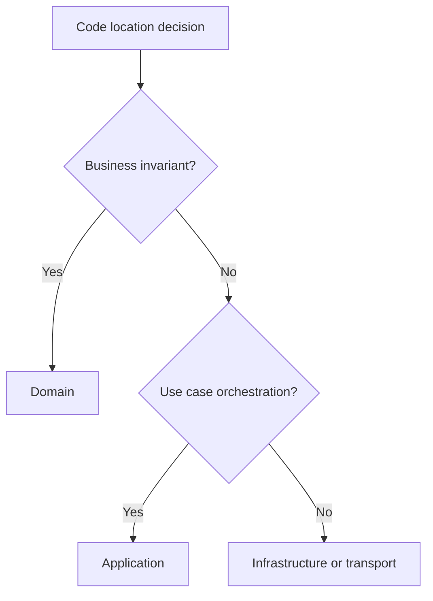

# Onion Architecture

Onion Architecture places the domain model at the center, surrounded by
application services, then infrastructure and transport adapters.

## Philosophy

The most important rules should be the least dependent. Onion architecture makes
domain policy stable while outer layers change around it.

## Rules

- Domain model is the center.
- Application services coordinate domain behavior.
- Infrastructure implements persistence, messaging, and external integrations.
- Transport adapters translate external protocols.
- No inward layer imports an outward layer.

## Bad Example

```python
class RetentionDays(BaseModel):
    value: int
```

Domain value object depends on Pydantic.

## Good Example

```python
@dataclass(frozen=True)
class RetentionDays:
    value: int
```

Boundary schemas map to domain values.

## Decision Tree



## AI Guidance

- Use onion layers to decide where code belongs.
- Do not confuse API schemas or ORM models with the domain.
- Keep domain tests fast and infrastructure-free.

## Review Checklist

- Domain has no outward dependencies.
- Application layer coordinates but does not contain transport code.
- Infrastructure is replaceable.
- Boundary mapping is explicit.
- Layer violations are recorded or fixed.

## References

- Domain Standards: `../domain/README.md`
- Pydantic v2: `../python/pydantic-v2.md`
- SQLAlchemy 2.x: `../python/sqlalchemy2.md`
