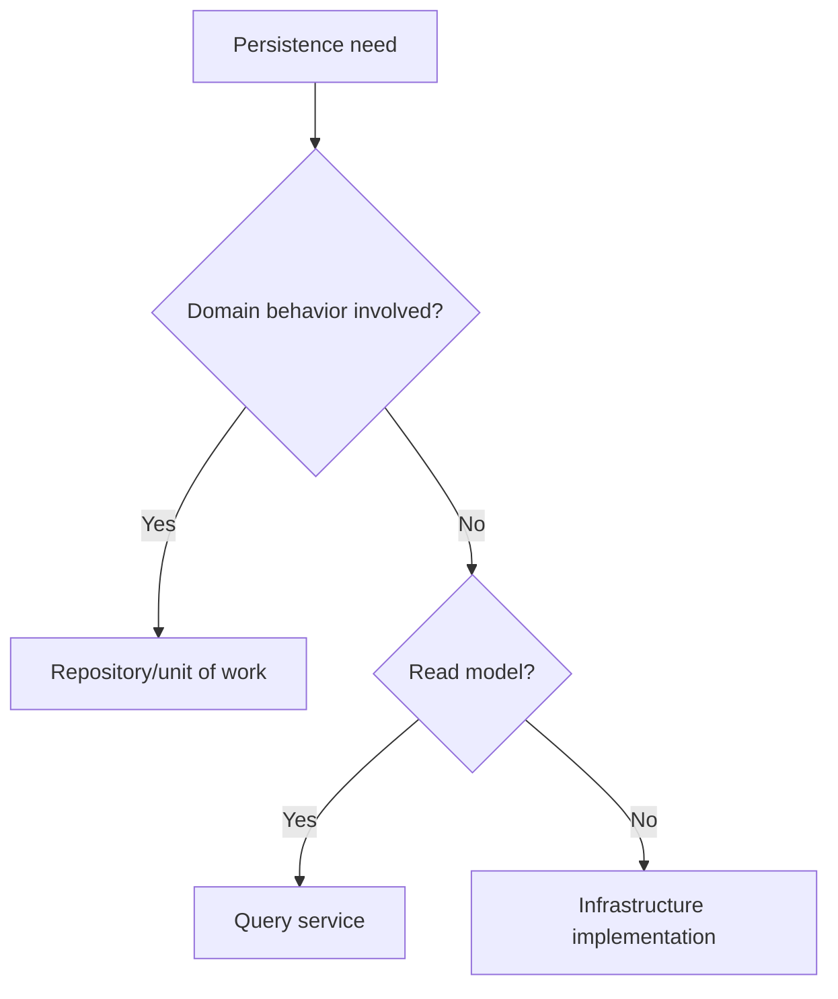

# Persistence Architecture

Persistence architecture defines how data is stored, loaded, migrated, and
protected without letting the database dictate the domain.

## Philosophy

Databases are operationally critical and architecturally external to domain
policy. Persistence should enforce integrity while keeping business behavior
testable.

## Rules

- Keep transaction boundaries explicit.
- Use repositories or query services where persistence details would leak.
- Do not expose ORM models through APIs.
- Pair schema changes with Alembic migrations and deployment notes.
- Use database constraints for integrity that must survive concurrency.
- Review indexes for important queries.

## Bad Example

```python
@router.get("/jobs/{id}")
def get_job(id: str) -> JobRecord:
    return session.get(JobRecord, id)
```

## Good Example

```python
result = await service.get_job(GetJobQuery(job_id=job_id))
return JobResponse.from_result(result)
```

## Decision Tree



## AI Guidance

- Treat migrations as release work.
- Avoid lazy-loading surprises across layers.
- Do not let ORM shape define API contracts.

## Review Checklist

- Transaction boundaries are clear.
- Data integrity is enforced appropriately.
- ORM models stay internal.
- Migration and rollback/mitigation are documented.
- Query performance is considered.

## References

- Repositories: `../domain/repositories.md`
- SQLAlchemy 2.x: `../python/sqlalchemy2.md`
- Database Engineer: `../agents/database.md`
