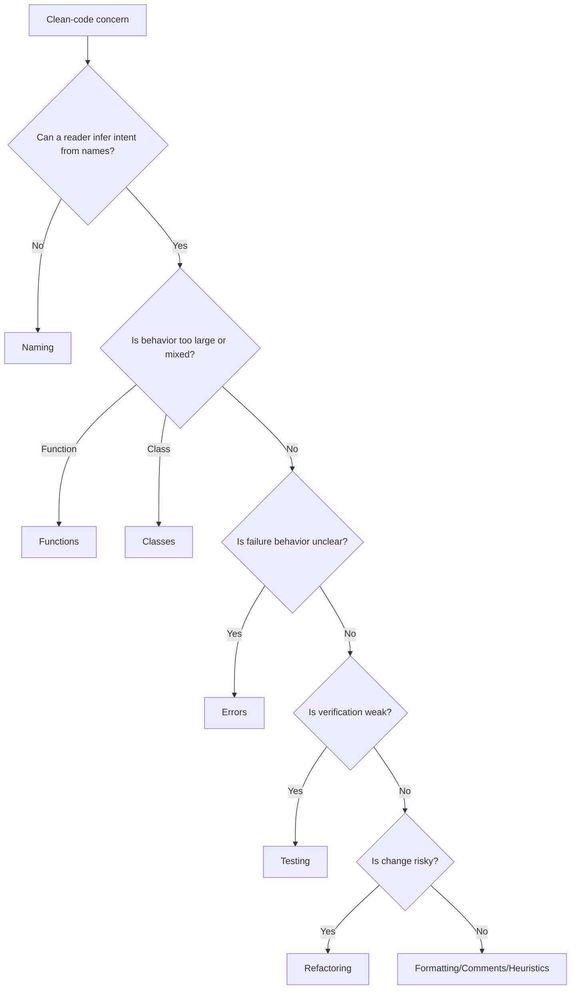

# Clean Code Standards Index

Clean-code standards govern local implementation quality: names, functions,
classes, comments, errors, formatting, tests, refactoring, and review
heuristics. They apply inside the architecture, domain, API, and Python
boundaries defined elsewhere in the AI-OS.

## Use This Index

Use this page when a change is syntactically valid but still hard to read,
review, test, or safely modify.

## Severity Model

| Severity | Meaning | Required Action |
| --- | --- | --- |
| Critical | Code hides business behavior, security decisions, or data mutation in a way reviewers cannot verify. | Block completion until clarified or isolated. |
| High | Code is difficult to test, broad in responsibility, or likely to cause repeated defects. | Fix in the phase or record owned debt. |
| Medium | Code is locally confusing, inconsistent, or harder to change than necessary. | Improve while touching the area. |
| Low | Minor naming, formatting, or comment quality issue. | Fix opportunistically. |

## Standards Catalog

| Standard | Use When | Common Findings |
| --- | --- | --- |
| [Naming](naming.md) | Choosing identifiers for modules, classes, functions, variables, tests, and constants. | Vague names, abbreviations, type suffixes |
| [Functions](functions.md) | Designing units of behavior. | Long functions, mixed abstraction levels |
| [Classes](classes.md) | Designing cohesive objects and services. | God classes, data bags, inheritance abuse |
| [Comments](comments.md) | Deciding what to explain in code. | Stale comments, restating code |
| [Errors](errors.md) | Handling expected and unexpected failures. | Swallowed exceptions, ambiguous errors |
| [Formatting](formatting.md) | Applying layout and style rules. | Hand-formatted code, inconsistent imports |
| [Testing](testing.md) | Making behavior verifiable. | Brittle tests, weak assertions |
| [Refactoring](refactoring.md) | Improving design without changing behavior. | Large unguarded rewrites |
| [Heuristics](heuristics.md) | Reviewing code that does not fit one category. | Principle conflicts, unclear trade-offs |

## Routing Decision Tree

## AI Guidance

- Prefer the smallest readable change that preserves behavior.
- Do not rewrite working code just to match taste.
- Cite the specific clean-code standard in review findings.
- Pair clean-code fixes with tests when behavior might be affected.
- Escalate to architecture standards when the problem is dependency direction,
  persistence ownership, API contract design, or domain modeling.

## References

- Code Review: `../checklists/code-review.md`
- Engineering Principles: `../engineering/README.md`
- Smells: `../smells/README.md`
- Anti-Patterns: `../anti-patterns/README.md`
- Python Standards: `../python/README.md`
