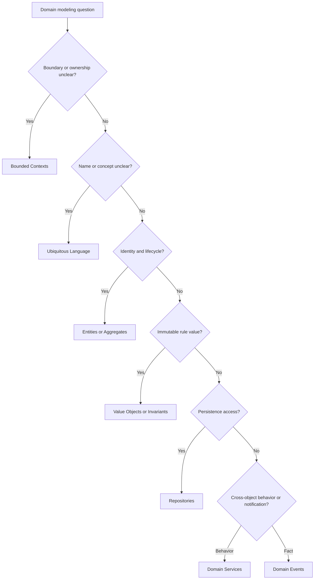

# Domain Modeling Standards

Domain standards define how business behavior is modeled independently of
FastAPI, SQLAlchemy, Pydantic, Redis, queues, files, and external services.

## Use This Index

Use this page when a change introduces or modifies business rules, language,
state transitions, aggregates, repositories, domain services, or domain events.

## Severity Model

| Severity | Meaning | Required Action |
| --- | --- | --- |
| Critical | Business invariant, authorization boundary, money/data integrity, or tenant isolation can be violated. | Block completion or require formal exception. |
| High | Domain behavior is scattered, framework-coupled, duplicated, or untestable. | Fix in current phase when in scope or record owned debt. |
| Medium | Model names, boundaries, or responsibilities are unclear but locally contained. | Fix opportunistically or schedule targeted modeling work. |
| Low | Local naming or documentation mismatch. | Improve under Boy Scout Rule when safe. |

## Standards Catalog

| Standard | Use When | Common Findings |
| --- | --- | --- |
| [Bounded Contexts](bounded-contexts.md) | Defining ownership and model boundaries. | Cross-context imports, shared ambiguous models |
| [Ubiquitous Language](ubiquitous-language.md) | Naming business concepts. | Vague terms, inconsistent names |
| [Entities](entities.md) | Modeling identity and lifecycle. | Anemic entities, public mutable state |
| [Value Objects](value-objects.md) | Modeling immutable concepts and validation. | Primitive obsession, data clumps |
| [Aggregates](aggregates.md) | Protecting consistency boundaries. | Invariant leakage, oversized aggregates |
| [Invariants](invariants.md) | Enforcing rules that must always hold. | Validation scattered across layers |
| [Repositories](repositories.md) | Isolating persistence behind collection-like contracts. | ORM leakage, session coupling |
| [Domain Services](domain-services.md) | Modeling domain behavior spanning objects. | God services, misplaced application logic |
| [Domain Events](domain-events.md) | Recording meaningful domain facts. | Hidden side effects, tight coupling |

## Routing Decision Tree

## AI Guidance

- Start with language and business rules before classes.
- Keep domain code free of framework, ORM, HTTP, and environment dependencies.
- Model invariants where they can be enforced consistently.
- Record important domain discoveries in Project Brain.

## References

- Architecture Constitution: `../architecture/constitution.md`
- Engineering Principles: `../engineering/README.md`
- Code Review: `../checklists/code-review.md`
- Architecture Review: `../checklists/architecture-review.md`
