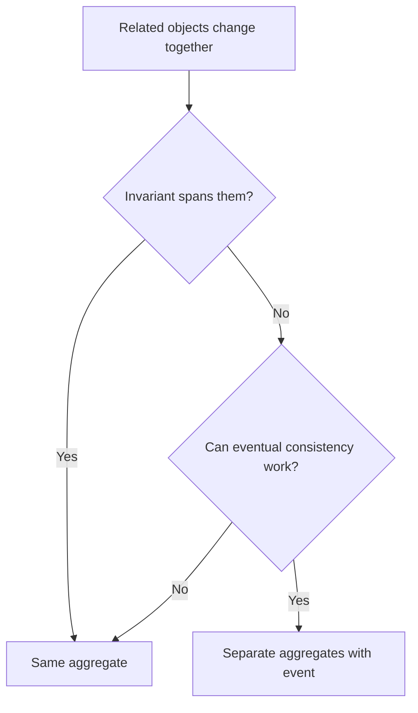

# Aggregates

An aggregate is a consistency boundary around entities and value objects that
must change together to protect invariants.

## Philosophy

Aggregates prevent the system from modifying related domain state in unsafe
ways. They should be as small as possible while still protecting rules that must
always hold.

## Rules

- Define one aggregate root as the public entry point.
- Modify internal entities through the aggregate root.
- Keep aggregates small and transactionally meaningful.
- Reference other aggregates by identity, not object graph, unless a true
  consistency boundary requires otherwise.
- Persist aggregates through repositories.

## Bad Example

```python
job.steps[0].status = "complete"
job.status = "running"
```

External code bypasses aggregate consistency.

## Good Example

```python
job.mark_step_completed(step_id)
```

The aggregate root enforces consistency.

## Decision Tree



## AI Guidance

- Do not create huge aggregates to avoid thinking about boundaries.
- Put consistency rules in aggregate methods.
- Use domain events for cross-aggregate reactions.

## Review Checklist

- Aggregate root is clear.
- Invariants are enforced through root methods.
- Aggregate size is justified.
- Cross-aggregate references are by identity where practical.
- Tests cover consistency rules.

## References

- Entities: `entities.md`
- Invariants: `invariants.md`
- Domain Events: `domain-events.md`
