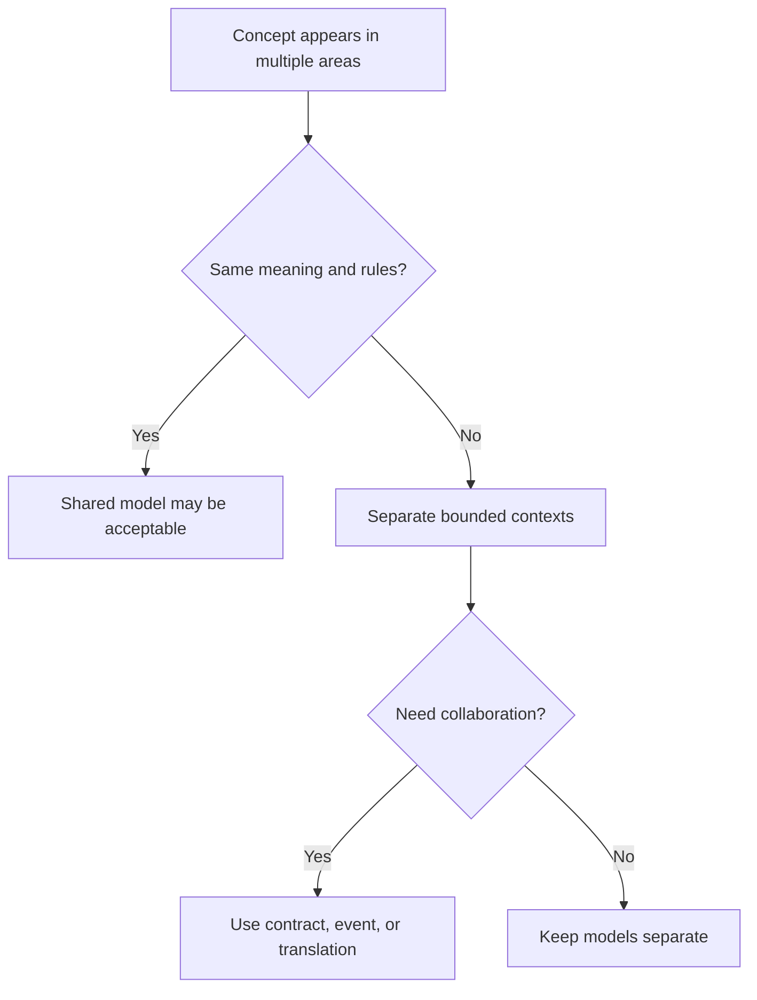

# Bounded Contexts

A bounded context is an explicit boundary within which a domain model, language,
rules, and ownership are consistent.

## Philosophy

Large systems fail when one model tries to mean everything to everyone. A
`User`, `Job`, or `Backup` may mean different things in billing, operations,
security, and support. Bounded contexts make those differences explicit.

## Rules

- Define context ownership before sharing domain models.
- Do not import another context's internals for convenience.
- Communicate across contexts through APIs, events, DTOs, or published
  contracts.
- Keep ubiquitous language consistent inside a context.
- Record context boundaries and translation rules in Project Brain or ADRs.

## Bad Example

```python
from billing.invoice import Invoice


class BackupJob:
    def attach_invoice(self, invoice: Invoice) -> None:
        self.invoice_status = invoice.internal_status
```

The backup context depends on billing internals.

## Good Example

```python
@dataclass(frozen=True)
class BillingStatusSnapshot:
    invoice_id: str
    payable: bool


class BackupJob:
    def apply_billing_status(self, status: BillingStatusSnapshot) -> None:
        if not status.payable:
            self.pause_for_billing_review()
```

The context consumes a published concept, not internals.

## Decision Tree



## AI Guidance

- Treat identical nouns as suspicious until rules are compared.
- Do not centralize models across contexts to reduce imports.
- Prefer translation objects over direct cross-context dependency.

## Review Checklist

- Context ownership is named.
- Language is consistent within the context.
- Cross-context collaboration uses explicit contracts.
- No internal model leakage exists.
- Boundary decisions are recorded.

## References

- Ubiquitous Language: `ubiquitous-language.md`
- Domain Events: `domain-events.md`
- Tight Coupling: `../anti-patterns/tight-coupling.md`
