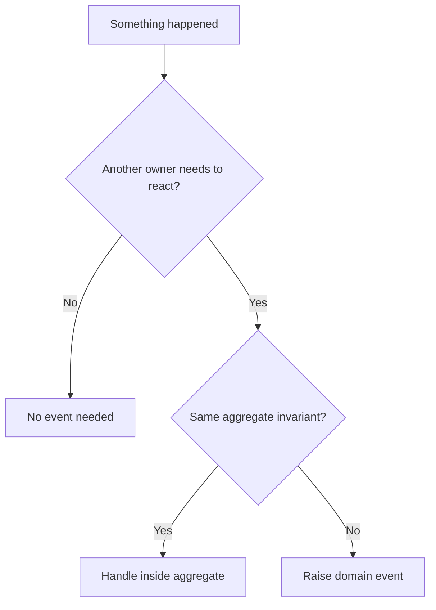

# Domain Events

Domain events record meaningful facts that happened in the domain.

## Philosophy

Events decouple reactions from the action that caused them. They are useful when
another part of the system needs to know something happened without the source
owning the reaction.

Events are not a substitute for clear commands, transactions, or consistency
boundaries.

## Rules

- Name events in past tense: `BackupCompleted`, `InvoiceApproved`.
- Include stable identifiers and facts needed by subscribers.
- Do not include ORM models or mutable entities in events.
- Publish events after the domain action succeeds and transaction boundaries are
  understood.
- Use events for cross-aggregate or cross-context reactions, not direct
  synchronous rules inside one aggregate.

## Bad Example

```python
class BackupEvent:
    def __init__(self, backup_record: BackupRecord) -> None:
        self.backup_record = backup_record
```

The event leaks persistence internals.

## Good Example

```python
@dataclass(frozen=True)
class BackupCompleted:
    backup_id: str
    completed_at: datetime
```

The event is an immutable domain fact.

## Decision Tree



## AI Guidance

- Use events to represent facts, not commands.
- Keep event payloads small and stable.
- Clarify sync vs async handling and transaction timing.
- Record event contracts when they cross bounded contexts.

## Review Checklist

- Event name is past tense and domain-specific.
- Payload contains stable facts, not infrastructure objects.
- Transaction and publication timing are clear.
- Subscribers do not create circular dependencies.
- Cross-context event contracts are documented.

## References

- Aggregates: `aggregates.md`
- Bounded Contexts: `bounded-contexts.md`
- Observer Pattern: `../patterns/observer.md`
