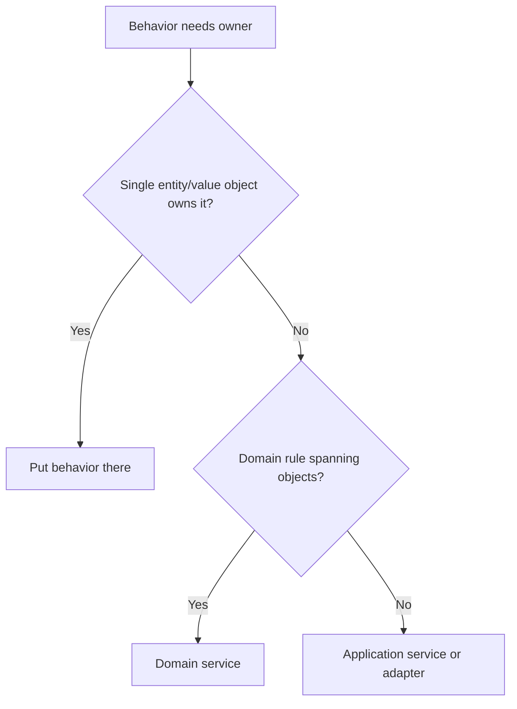

# Domain Services

Domain services model domain behavior that does not naturally belong to a single
entity or value object.

## Philosophy

Not every domain rule fits an entity. A domain service is appropriate when the
behavior is part of the domain language and spans multiple domain objects.
Application orchestration, persistence, HTTP, and external calls are not domain
services.

## Rules

- Use a domain service only for domain behavior.
- Keep it stateless where practical.
- Pass required entities and value objects explicitly.
- Do not inject repositories, sessions, clients, or framework objects unless the
  service is actually an application service.
- Name it after a domain capability, not a technical action.

## Bad Example

```python
class BackupDomainService:
    def __init__(self, repository: BackupRepository, storage: StorageClient) -> None:
        ...
```

This is application orchestration, not a pure domain service.

## Good Example

```python
class BackupRetentionPolicy:
    def can_delete(self, backup: Backup, policy: RetentionPolicy, today: date) -> bool:
        return backup.completed_before(today - policy.minimum_age)
```

The service models domain policy without infrastructure.

## Decision Tree



## AI Guidance

- Do not create domain services to avoid putting behavior in entities.
- Keep domain services free of I/O.
- If the service coordinates repositories and gateways, call it an application
  service.

## Review Checklist

- Service represents domain language.
- It does not hide infrastructure dependencies.
- It has clear inputs and outputs.
- Entities are not made anemic by unnecessary extraction.
- Tests cover policy behavior directly.

## References

- Entities: `entities.md`
- Tell, Don't Ask: `../engineering/tell-dont-ask.md`
- God Class: `../smells/god-class.md`
