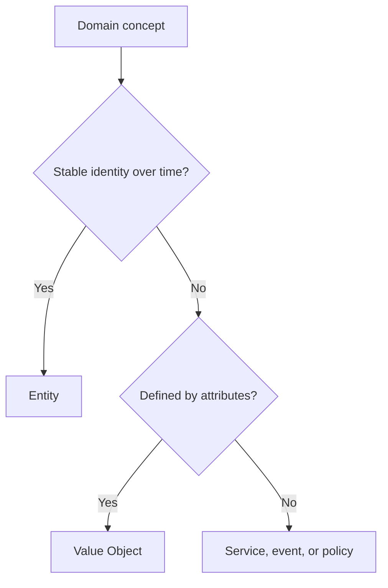

# Entities

Entities are domain objects with identity and lifecycle. Their identity remains
stable even when attributes change.

## Philosophy

Entities are not ORM records. They represent business objects whose behavior,
state transitions, and invariants matter over time.

## Rules

- Give entities explicit identity.
- Keep state transitions as named methods.
- Protect invariants inside entity methods or aggregate boundaries.
- Avoid public mutable fields for important state.
- Do not inject repositories, sessions, HTTP clients, or settings into entities.

## Bad Example

```python
backup.status = "complete"
backup.completed_at = datetime.utcnow()
```

External code mutates state and bypasses rules.

## Good Example

```python
backup.mark_completed(completed_at=clock.utcnow())
```

The entity owns the transition.

## Decision Tree



## AI Guidance

- Do not make entities passive bags of ORM fields.
- Keep external side effects outside entities.
- Put lifecycle rules close to the state they protect.

## Review Checklist

- Identity is explicit.
- Important transitions are named methods.
- Invariants cannot be bypassed casually.
- Entity does not depend on infrastructure.
- Tests cover state transitions and invalid transitions.

## References

- Aggregates: `aggregates.md`
- Invariants: `invariants.md`
- Tell, Don't Ask: `../engineering/tell-dont-ask.md`
