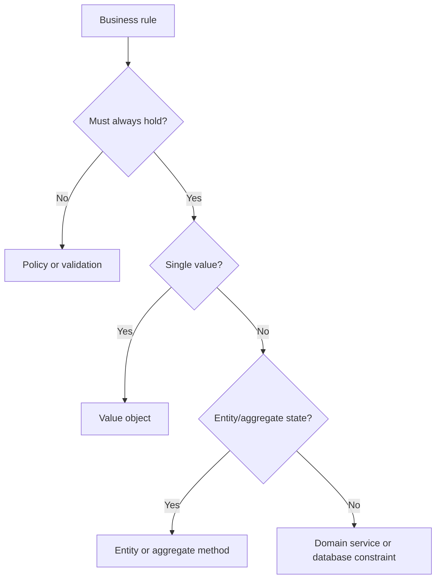

# Invariants

Invariants are business rules that must always hold true for valid domain state.

## Philosophy

An invariant that can be bypassed is not really enforced. Invariants belong
where the system can protect them consistently: value objects, entities,
aggregates, domain services, or database constraints when appropriate.

## Rules

- Name important invariants explicitly.
- Enforce invariants at construction or state transition.
- Do not rely only on UI or API validation for domain invariants.
- Use database constraints for data integrity invariants that must survive
  concurrency and failure.
- Test valid, invalid, and boundary cases.

## Bad Example

```python
if request.retention_days < 1:
    raise HTTPException(400)
```

The invariant exists only in one route.

## Good Example

```python
RetentionDays(request.retention_days)
```

The invariant is enforced wherever the concept is created.

## Decision Tree



## AI Guidance

- Search for duplicated validation before adding a new rule.
- Move repeated rules into the owning domain concept.
- Pair domain invariants with persistence constraints when data integrity
  requires it.

## Review Checklist

- Invariant owner is clear.
- Rule cannot be bypassed through normal code paths.
- Boundary validation does not replace domain enforcement.
- Tests cover boundary and invalid cases.
- Persistence constraints are used when needed.

## References

- Value Objects: `value-objects.md`
- Aggregates: `aggregates.md`
- Fail Fast: `../engineering/fail-fast.md`
