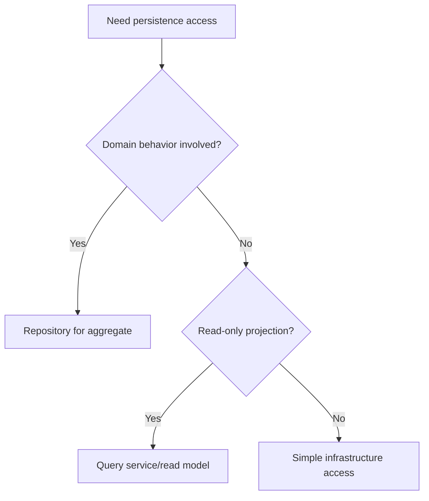

# Repositories

Repositories provide collection-like access to aggregates while hiding
persistence details.

## Philosophy

Application services need to load and save domain objects without knowing SQL,
ORM sessions, table shape, or external storage details. Repositories are ports
for persistence, not generic data access dumping grounds.

## Rules

- Define repository interfaces around aggregate needs.
- Keep SQLAlchemy sessions and queries in infrastructure implementations.
- Return domain objects or read models, not ORM internals.
- Keep transaction boundaries explicit through unit-of-work or application
  orchestration.
- Avoid repositories for every table by default.

## Bad Example

```python
class BackupService:
    def __init__(self, session: Session) -> None:
        self._session = session

    def run(self, backup_id: str) -> None:
        record = self._session.get(BackupRecord, backup_id)
        record.status = "running"
```

The service is coupled to ORM state.

## Good Example

```python
class BackupRepository(Protocol):
    def get_required(self, backup_id: BackupId) -> Backup: ...
    def save(self, backup: Backup) -> None: ...
```

The application depends on a persistence contract.

## Decision Tree



## AI Guidance

- Do not expose ORM models from repositories.
- Keep repository methods named by domain intent.
- Avoid one repository per table unless the table is an aggregate root.
- Coordinate transactions outside domain objects.

## Review Checklist

- Repository contract is domain-oriented.
- Infrastructure implementation hides SQLAlchemy details.
- Transaction ownership is clear.
- Tests can fake repository behavior.
- Read models are separated from command models where useful.

## References

- Aggregates: `aggregates.md`
- SQLAlchemy 2.x: `../python/sqlalchemy2.md`
- Dependency Injection: `../engineering/dependency-injection.md`
