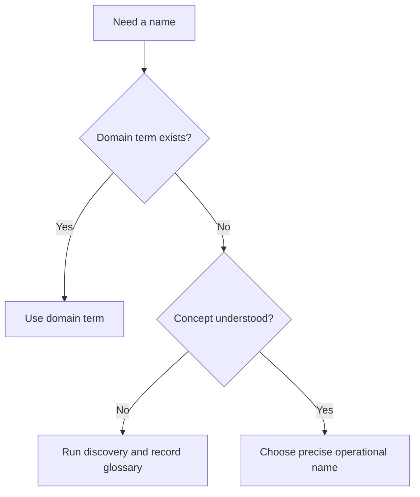

# Ubiquitous Language

Ubiquitous language is the shared vocabulary used by domain experts, engineers,
tests, documentation, APIs, and AI agents within a bounded context.

## Philosophy

Names are design. When code uses vague or inconsistent terms, business rules
become harder to find and easier to duplicate. Good language reduces accidental
complexity before code is written.

## Rules

- Use domain terms in classes, methods, tests, events, and documentation.
- Avoid vague names such as `manager`, `processor`, `data`, and `handler` unless
  the domain uses them precisely.
- Record glossary terms in Project Brain.
- Do not reuse the same term for different concepts inside one context.
- Translate terms explicitly across bounded contexts.

## Bad Example

```python
class JobProcessor:
    def process(self, data: dict) -> None:
        ...
```

The name hides the business operation.

## Good Example

```python
class BackupApprovalService:
    def approve_scheduled_backup(self, command: ApproveBackupCommand) -> None:
        ...
```

The operation is visible in the domain language.

## Decision Tree



## AI Guidance

- Rename vague generated names before they become standards.
- Ask whether a term means the same thing to product, operations, and code.
- Update glossary when durable language is discovered.

## Review Checklist

- Names match business meaning.
- Tests use domain language.
- Ambiguous terms are defined or replaced.
- Cross-context translations are explicit.
- Glossary is updated for durable terms.

## References

- Project Brain Glossary: `../brain/glossary.md`
- Bounded Contexts: `bounded-contexts.md`
- CUPID: `../engineering/cupid.md`
