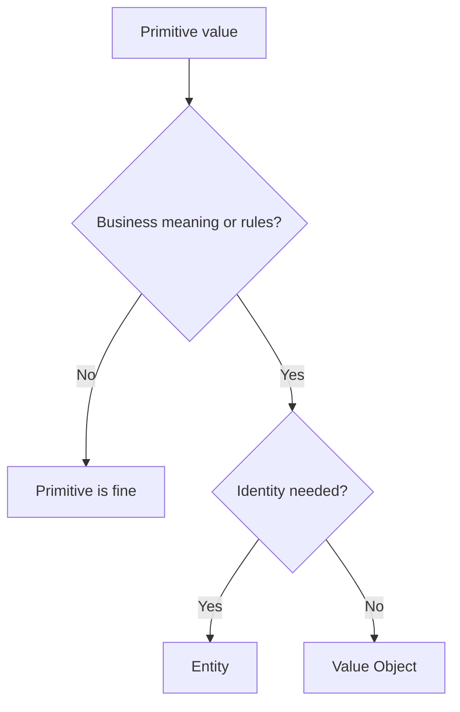

# Value Objects

Value objects are immutable domain concepts defined by their attributes rather
than identity.

## Philosophy

Value objects make business meaning explicit and stop validation from scattering
through routers, services, and tests. They are the preferred remedy for
primitive obsession when a value has rules.

## Rules

- Use value objects for concepts with validation, units, formatting, or equality
  semantics.
- Keep them immutable.
- Validate invariants at construction.
- Avoid infrastructure dependencies.
- Preserve wire format through explicit mapping at boundaries.

## Bad Example

```python
def schedule_backup(retention_days: int) -> None:
    if retention_days < 1 or retention_days > 365:
        raise ValueError("invalid retention")
```

## Good Example

```python
@dataclass(frozen=True)
class RetentionDays:
    value: int

    def __post_init__(self) -> None:
        if self.value < 1 or self.value > 365:
            raise ValueError("retention must be between 1 and 365 days")
```

## Decision Tree



## AI Guidance

- Do not wrap every primitive.
- Wrap values that carry risk, rules, units, or repeated validation.
- Keep serialization concerns outside value objects unless explicitly needed.

## Review Checklist

- Value object has a precise domain name.
- It is immutable.
- It enforces local invariants.
- Boundary mapping preserves API compatibility.
- Tests cover invalid and boundary values.

## References

- Primitive Obsession: `../smells/primitive-obsession.md`
- Data Clumps: `../smells/data-clumps.md`
- Pydantic v2: `../python/pydantic-v2.md`
