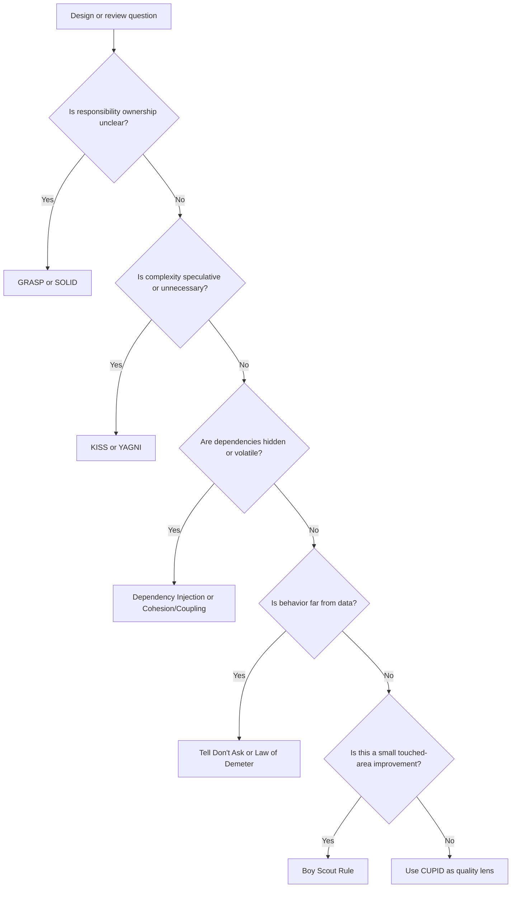

# Engineering Principles Index

Engineering principles explain why the AI-OS review standards exist and how
agents should choose between competing design options. They are not slogans.
They are decision tools used during discovery, design, implementation, and
review.

## Use This Index

Use this page when:

- a review finding needs design rationale;
- two principles appear to conflict;
- an agent needs to choose a refactoring strategy;
- a design exception needs to be justified;
- a smell or anti-pattern points to a deeper responsibility problem.

## Severity Model

| Severity | Meaning | Required Action |
| --- | --- | --- |
| Critical | Principle violation creates security, data integrity, operational, or architecture constitution risk. | Block completion or require formal exception. |
| High | Violation creates hidden dependencies, unsafe change amplification, or prevents reliable testing. | Fix in current phase when in scope, otherwise record debt with owner. |
| Medium | Violation reduces clarity, cohesion, or maintainability in a bounded area. | Fix opportunistically or schedule targeted refactor. |
| Low | Local readability or consistency issue. | Improve under Boy Scout Rule when touching the area. |

## Principle Catalog

| Principle | Use When | Common Finding Routes |
| --- | --- | --- |
| [DRY](dry.md) | Same knowledge or rule appears in multiple places. | Duplicate code, magic values, data clumps |
| [KISS](kiss.md) | A design is more complex than the goal requires. | Service locator, speculative abstractions, long method |
| [YAGNI](yagni.md) | A capability is being added for imagined future use. | Dead code, unused extension points |
| [SOLID](solid.md) | Responsibilities, variation, contracts, or dependency direction are unclear. | God class, shotgun surgery, tight coupling |
| [Dependency Injection](dependency-injection.md) | Side-effecting collaborators are hidden or constructed internally. | Service locator, singleton abuse, hidden side effects |
| [High Cohesion and Low Coupling](high-cohesion-low-coupling.md) | Changes scatter or modules have unclear ownership. | Tight coupling, god class, shotgun surgery |
| [Composition over Inheritance](composition-over-inheritance.md) | Reuse or variation is being modeled with fragile inheritance. | Shotgun surgery, tight coupling |
| [Fail Fast](fail-fast.md) | Invalid state can travel too far before failing. | Hidden side effects, magic values |
| [Law of Demeter](law-of-demeter.md) | Callers reach through object graphs or internals. | Feature envy, tight coupling |
| [Tell, Don't Ask](tell-dont-ask.md) | External code asks for data and makes domain decisions. | Feature envy, primitive obsession |
| [GRASP](grasp.md) | Responsibility assignment is unclear. | God class, low cohesion, feature envy |
| [CUPID](cupid.md) | Code quality needs humane, composable design guidance. | Over-complex code, weak domain language |
| [Boy Scout Rule](boy-scout-rule.md) | A touched area has small safe improvements available. | Dead code, naming, duplication |

## Routing Decision Tree

## Conflict Resolution

- KISS vs SOLID: choose the simpler design unless a real boundary, variation,
  or side effect requires structure.
- DRY vs KISS: remove duplicated knowledge, not harmless similar syntax.
- YAGNI vs Architecture Constitution: required boundaries are not speculative.
- Tell, Don't Ask vs Application Services: keep orchestration in application
  services, but move domain decisions to domain owners.
- Boy Scout Rule vs Scope Control: make small safe improvements only when they
  do not obscure the primary goal.

## AI Guidance

- Cite a principle only when it explains a concrete risk or decision.
- Pair principle findings with specific smell or anti-pattern findings when
  possible.
- Do not use principles to justify broad rewrites without goal, scope, and
  acceptance criteria.
- Prefer changes that improve ownership, explicitness, and testability.

## References

- Architecture Constitution: `../architecture/constitution.md`
- Smell Review Index: `../smells/README.md`
- Anti-Pattern Review Index: `../anti-patterns/README.md`
- Code Review Checklist: `../checklists/code-review.md`
- Architecture Review Checklist: `../checklists/architecture-review.md`
