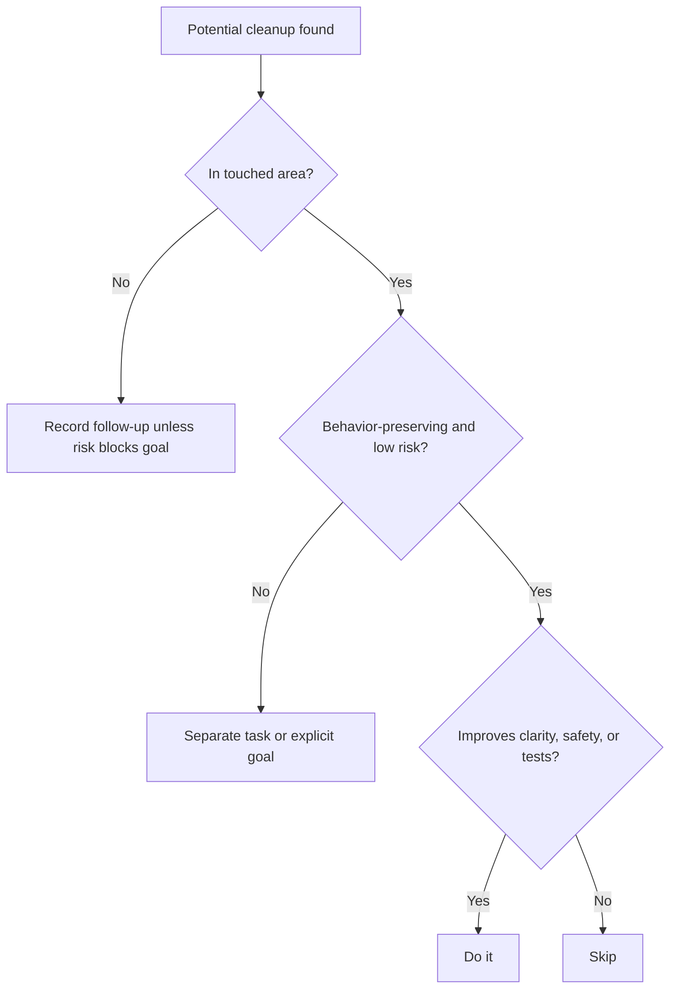

# Boy Scout Rule

The Boy Scout Rule means leaving touched code better than you found it through
small, safe, goal-aligned improvements.

## Philosophy

Legacy modernization succeeds through steady improvement, not only large
rewrite phases. When agents touch a file, they should remove small hazards,
clarify names, delete obvious dead code, or tighten tests when doing so is safe
and does not obscure the primary goal.

The rule is not permission for unbounded refactoring. Improvements must remain
reviewable and aligned with the current task.

## Explanation

Appropriate improvements:

- remove unused imports;
- delete commented-out code;
- clarify a misleading local name;
- extract a repeated literal into a named value;
- add a missing assertion in a touched test;
- split a clearly unsafe long conditional;
- add a cross-link to the correct source of truth.

Inappropriate improvements:

- broad rewrites unrelated to the goal;
- changing public behavior without acceptance criteria;
- refactoring many untouched files;
- introducing abstractions for speculative future use;
- mixing cleanup with risky logic changes.

## Bad Example

```text
Task: update backup retention validation.
Change: rewrites storage adapters, renames modules, changes API response shape,
and updates retention validation in the same commit.
```

The cleanup hides the functional change and expands review risk.

## Good Example

```text
Task: update backup retention validation.
Change: updates validation, adds boundary tests, removes an unused import in the
touched file, and names the retention limit constant.
```

The improvement is local and supports the goal.

## Decision Tree



## AI Guidance

- Keep cleanup commits or sections easy to review.
- Do not use the rule to justify scope creep.
- Prefer obvious, behavior-preserving improvements.
- If cleanup reveals deeper debt, record it in Project Brain rather than
  expanding the phase silently.
- Mention meaningful cleanup in the final summary.

## Review Checklist

- Improvements are in files already touched for the goal.
- Behavior changes are intentional and covered by acceptance criteria.
- Cleanup reduces risk or improves clarity.
- The diff remains reviewable.
- Larger opportunities are recorded as debt or next tasks.

## References

- Dead Code: `../smells/dead-code.md`
- YAGNI: `yagni.md`
- Code Review Checklist: `../checklists/code-review.md`
- Project Brain: `../brain/README.md`
