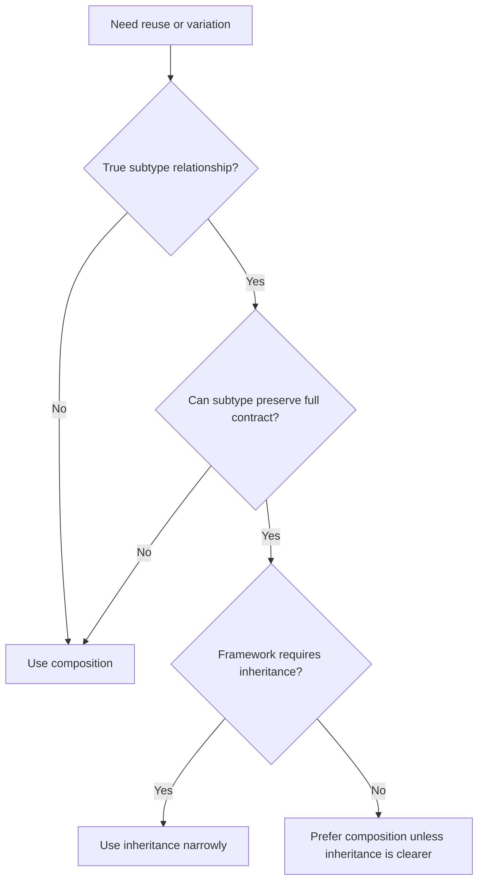

# Composition Over Inheritance

Composition over inheritance means building behavior by combining explicit
collaborators instead of relying on subclass hierarchies for reuse and
variation.

## Philosophy

Inheritance couples a child to parent implementation details. It is appropriate
for true subtype relationships with stable contracts, but it is often abused to
share code or vary behavior. Composition keeps dependencies visible and supports
small, replaceable policies.

## Explanation

Prefer composition for:

- external adapters;
- validation and pricing policies;
- storage providers;
- retry, timeout, and rendering strategies;
- use-case orchestration;
- behavior that changes independently.

Inheritance may be acceptable for:

- framework-required base classes;
- exception hierarchies;
- immutable value type specialization with preserved contracts;
- stable subtype relationships where Liskov substitution holds.

## Bad Example

```python
class BaseUploader:
    def upload(self, path: str) -> None:
        self.before_upload()
        self.do_upload(path)
        self.after_upload()


class S3Uploader(BaseUploader):
    def do_upload(self, path: str) -> None:
        ...
```

The base class controls lifecycle and subclasses depend on hooks that may not
fit every provider.

## Good Example

```python
class UploadService:
    def __init__(self, storage: StorageGateway, audit: AuditLog) -> None:
        self._storage = storage
        self._audit = audit

    async def upload(self, artifact: BackupArtifact) -> StoredArtifact:
        stored = await self._storage.store(artifact)
        await self._audit.record_upload(stored)
        return stored
```

The workflow composes explicit collaborators.

## Decision Tree



## AI Guidance

- Do not create base classes just to avoid duplicate lines.
- Use protocols and injected strategies for replaceable behavior.
- Keep framework inheritance at the edge.
- If subclasses override many hooks, replace the hierarchy with composition.
- Check Liskov before accepting inheritance.

## Review Checklist

- Inheritance represents a real subtype relationship or framework constraint.
- Subclasses preserve parent contracts.
- Shared behavior is cohesive and not a hidden workflow trap.
- Composition was considered for variation points.
- Tests verify behavior through public contracts, not protected hooks.

## References

- SOLID: `solid.md`
- Strategy Pattern: `../patterns/strategy.md`
- Adapter Pattern: `../patterns/adapter.md`
- Shotgun Surgery: `../smells/shotgun-surgery.md`
