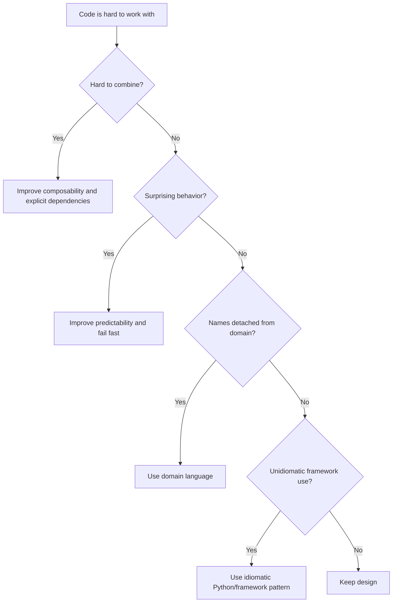

# CUPID

CUPID is a set of qualities for joyful, maintainable code: Composable,
Unix philosophy, Predictable, Idiomatic, and Domain-based.

## Philosophy

SOLID focuses on object-oriented structure. CUPID focuses on how code feels to
work with over time. It is useful for AI agents because generated code can be
technically structured but still awkward, surprising, or detached from the
domain.

Good code should fit together, do one thing well, behave predictably, use the
language naturally, and speak the business language.

## Explanation

### Composable

Components can be combined without hidden setup or surprising global state.

### Unix Philosophy

Pieces do one focused job well and communicate through clear contracts.

### Predictable

Names, errors, side effects, and performance match caller expectations.

### Idiomatic

Code uses Python, FastAPI, SQLAlchemy, Pydantic, and pytest in recognizable,
maintainable ways.

### Domain-Based

Names and boundaries reflect domain concepts rather than technical clutter.

## Bad Example

```python
def process(data: dict, mode: str, flag: bool) -> dict:
    if mode == "x" and flag:
        GlobalRegistry.get("client").send(data)
    return {"ok": True}
```

The function is not predictable, domain-based, or composable.

## Good Example

```python
class BackupDispatchService:
    def __init__(self, dispatcher: BackupDispatcher) -> None:
        self._dispatcher = dispatcher

    async def dispatch_approved_backup(self, backup: ApprovedBackup) -> DispatchResult:
        return await self._dispatcher.dispatch(backup)
```

The code has a clear domain operation and explicit collaborator.

## Decision Tree



## AI Guidance

- Prefer domain names over vague technical names.
- Avoid clever code that future agents must reverse engineer.
- Keep side effects visible so components remain composable.
- Use idiomatic Python and framework conventions unless a documented constraint
  requires otherwise.
- Check whether a generated abstraction makes the code more predictable.

## Review Checklist

- Components compose without hidden global setup.
- Each piece has a focused responsibility.
- Behavior, errors, and side effects are predictable.
- Code follows idiomatic Python and framework usage.
- Names reflect domain or operational language.
- The design feels easier to use after the change.

## References

- KISS: `kiss.md`
- Dependency Injection: `dependency-injection.md`
- Fail Fast: `fail-fast.md`
- Ubiquitous Language: `../domain/ubiquitous-language.md`
