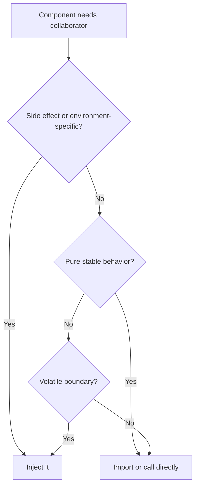

# Dependency Injection

Dependency Injection means providing a component's collaborators from the
outside instead of making the component locate, construct, or configure them
internally.

## Philosophy

Dependencies are part of design. When they are explicit, code is easier to test,
review, secure, and operate. When they are hidden behind service locators,
singletons, environment reads, or import-time construction, behavior becomes
runtime guesswork.

DI is not about using a container. It is about honest contracts.

## Explanation

Inject:

- repositories;
- gateways and external clients;
- clocks and random generators;
- settings used by core behavior;
- publishers and queues;
- storage and filesystem adapters;
- transaction or unit-of-work boundaries.

Do not inject:

- pure functions without state or side effects;
- simple value objects;
- framework objects into domain logic;
- dependencies that can be passed as normal function arguments more clearly.

## Bad Example

```python
class ReportService:
    def generate(self, report_id: str) -> bytes:
        client = PdfClient.from_environment()
        repository = Repository.current()
        return client.render(repository.load(report_id))
```

The service hides its collaborators and environment dependency.

## Good Example

```python
class ReportService:
    def __init__(self, reports: ReportRepository, renderer: ReportRenderer) -> None:
        self._reports = reports
        self._renderer = renderer

    def generate(self, report_id: str) -> bytes:
        return self._renderer.render(self._reports.load(report_id))
```

The composition root decides concrete implementations.

## Decision Tree



## AI Guidance

- Keep FastAPI dependency wiring at routers and composition roots.
- Use `Protocol` for side-effecting boundaries when it improves testability or
  replacement.
- Do not hide DI behind a service locator.
- If constructor parameters grow large, split responsibilities before adding a
  container.
- Inject clocks and randomness to make tests deterministic.

## Review Checklist

- Side-effecting collaborators are explicit.
- Domain and application logic do not call global registries or framework
  dependency lookup.
- Composition roots own construction and lifetime.
- Tests use fakes without patching hidden globals.
- Resource cleanup is explicit for clients, pools, and async resources.

## References

- Service Locator: `../anti-patterns/service-locator.md`
- Singleton Abuse: `../anti-patterns/singleton-abuse.md`
- Hidden Side Effects: `../smells/hidden-side-effects.md`
- FastAPI Dependencies: `../fastapi/dependencies.md`
