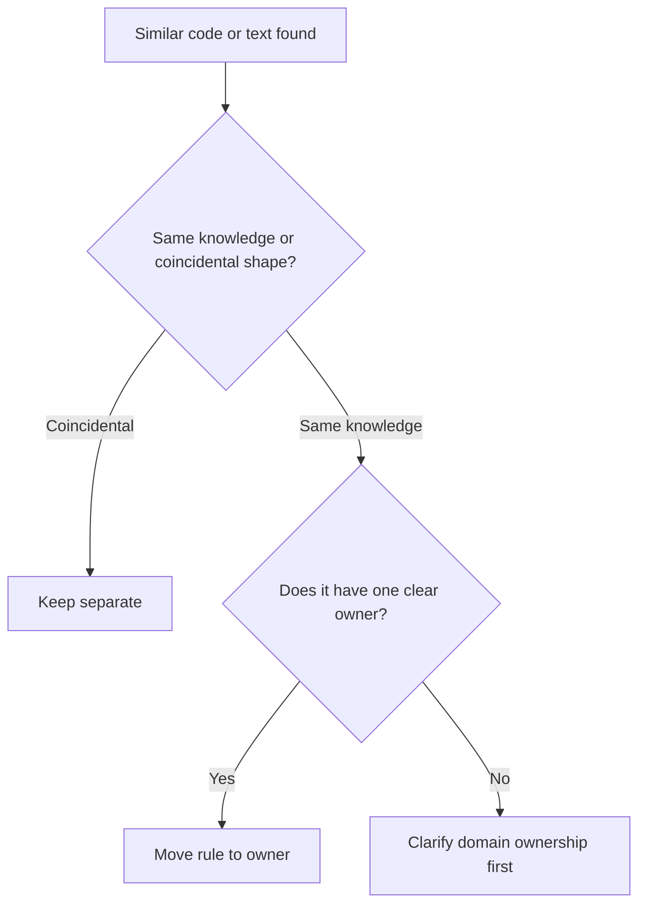

# DRY

DRY means every important piece of knowledge has one authoritative
representation. It is a rule about knowledge, not a demand to eliminate every
similar-looking line.

## Philosophy

Duplication is dangerous when duplicated code expresses the same business rule,
security decision, validation policy, workflow, or operational contract. It
creates drift: one copy changes and the other silently preserves old behavior.

Premature abstraction is also dangerous. Similar code may represent different
concepts that only look alike today. DRY must be balanced with KISS, YAGNI, and
high cohesion.

## Explanation

Apply DRY to:

- business rules;
- validation policies;
- authorization decisions;
- domain calculations;
- external integration contracts;
- migration and deployment procedures;
- durable documentation standards.

Do not blindly abstract:

- tests where repetition improves readability;
- two workflows that currently look similar but have different owners;
- local literals whose meaning is obvious;
- framework wiring that is intentionally explicit.

## Bad Example

```python
def create_user(email: str) -> None:
    if "@" not in email or len(email) > 254:
        raise ValueError("invalid email")


def invite_user(email: str) -> None:
    if "@" not in email or len(email) > 254:
        raise ValueError("invalid email")
```

The email policy is duplicated and can drift.

## Good Example

```python
from dataclasses import dataclass


@dataclass(frozen=True)
class EmailAddress:
    value: str

    def __post_init__(self) -> None:
        if "@" not in self.value or len(self.value) > 254:
            raise ValueError("invalid email address")
```

The rule has one owner and a domain name.

## Decision Tree



## AI Guidance

- Ask what knowledge is duplicated before extracting code.
- Prefer domain names over generic helpers.
- Do not create dumping-ground modules such as `utils.py` or `constants.py`.
- Link documentation to a source of truth instead of copying policy.
- When duplication crosses bounded contexts, verify whether the contexts truly
  share the same rule.

## Review Checklist

- Duplicated business rules have one authoritative owner.
- Extracted abstractions are cohesive and named by purpose.
- Tests cover shared behavior and important callers.
- Documentation avoids copied policy that can drift.
- No abstraction was added merely because code looked similar.

## References

- Duplicate Code: `../smells/duplicate-code.md`
- Data Clumps: `../smells/data-clumps.md`
- KISS: `kiss.md`
- YAGNI: `yagni.md`
