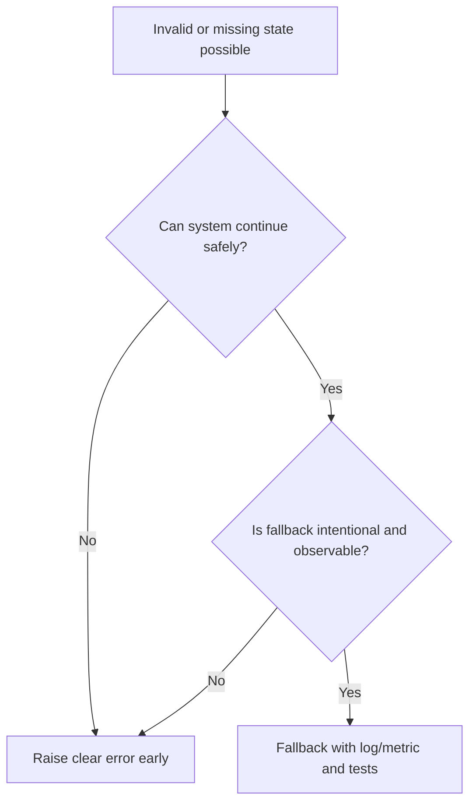

# Fail Fast

Fail fast means detecting invalid state, unsafe input, missing configuration,
and violated assumptions as early as possible with clear errors.

## Philosophy

Delayed failure turns one bug into many symptoms. In modernization work, silent
fallbacks and late errors make behavior hard to preserve and diagnose. Fail fast
keeps defects local and observable.

Fail fast does not mean crashing recklessly in production. It means rejecting
invalid states before they corrupt data, hide security issues, or trigger
misleading downstream behavior.

## Explanation

Fail fast applies to:

- required settings at startup;
- invalid domain values;
- unsupported enum states;
- missing dependencies;
- unsafe migrations;
- violated preconditions;
- external integration configuration;
- impossible branches.

Use graceful degradation only when it is a deliberate product or operational
decision with observability.

## Bad Example

```python
def connect(settings: Settings) -> Client | None:
    if not settings.api_key:
        return None
    return Client(settings.api_key)
```

The caller may fail later with an unrelated `None` error.

## Good Example

```python
def connect(settings: Settings) -> Client:
    if not settings.api_key:
        raise ConfigurationError("api_key is required for external client")
    return Client(settings.api_key)
```

The failure is immediate and actionable.

## Decision Tree



## AI Guidance

- Validate domain invariants at construction or command boundary.
- Validate configuration at startup, not first production use.
- Prefer explicit exceptions over silent defaults.
- Include enough context to diagnose without exposing secrets.
- Test failure paths, not only happy paths.

## Review Checklist

- Invalid states are rejected early.
- Errors are specific and actionable.
- Fallbacks are intentional, observable, and tested.
- Sensitive data is not included in error messages.
- Startup checks catch missing required configuration.

## References

- Hidden Side Effects: `../smells/hidden-side-effects.md`
- Domain Invariants: `../domain/invariants.md`
- Security Review: `../checklists/security-review.md`
- Observability: `../metrics/quality.md`
