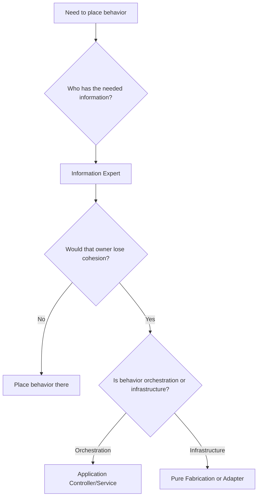

# GRASP

GRASP means General Responsibility Assignment Software Patterns. It helps
agents decide where behavior should live and how objects should collaborate.

## Philosophy

Most design problems are responsibility problems. When responsibility is placed
poorly, systems develop god classes, feature envy, shotgun surgery, and tight
coupling. GRASP provides a practical vocabulary for assigning responsibility
without jumping directly to frameworks or patterns.

## Explanation

Use these GRASP patterns pragmatically:

- Information Expert: assign behavior to the object with the information needed
  to fulfill it.
- Creator: assign object creation to the object that contains, aggregates, or
  closely uses the created object.
- Controller: use application or interface controllers to receive system events
  and delegate work.
- Low Coupling: reduce unnecessary dependency between components.
- High Cohesion: keep responsibilities focused and related.
- Polymorphism: assign behavior variation to interchangeable implementations
  when variation is real.
- Pure Fabrication: introduce a service or adapter when forcing behavior into a
  domain object would reduce cohesion.
- Indirection: introduce an intermediate contract to decouple collaborators
  when volatility or side effects justify it.
- Protected Variations: shield stable policy from known variation points.

## Bad Example

```python
class BackupController:
    async def run(self, request: BackupRequest) -> BackupResponse:
        if request.retention_days < 1:
            raise ValueError("invalid retention")
        artifact = await PostgresBackupTool().run(request.database_url)
        location = await S3Client().upload(artifact.path)
        await EmailClient().send("backup complete")
        return BackupResponse(location=location)
```

The controller owns validation, tool creation, storage, notification, and
response mapping.

## Good Example

```python
class RunBackupService:
    def __init__(self, planner: BackupPlanner, executor: BackupExecutor, storage: BackupStorage) -> None:
        self._planner = planner
        self._executor = executor
        self._storage = storage

    async def run(self, command: RunBackupCommand) -> StoredArtifact:
        plan = self._planner.create(command)
        artifact = await self._executor.execute(plan)
        return await self._storage.store(artifact)
```

Responsibilities are assigned to cohesive collaborators.

## Decision Tree



## AI Guidance

- Ask "who should know this?" before adding a new service.
- Do not put every behavior into entities; use Pure Fabrication when needed to
  preserve cohesion.
- Use Controller for system events, not as a dumping ground for business logic.
- Use Indirection only when it reduces real coupling.
- Prefer Protected Variations for stable extension points, not imagined futures.

## Review Checklist

- Responsibilities are assigned to information owners.
- Controllers delegate instead of doing all work.
- Services are cohesive and named by use case or domain role.
- Infrastructure concerns are isolated behind adapters or gateways.
- Variation is handled where it is real and stable.
- The design avoids god classes and feature envy.

## References

- SOLID: `solid.md`
- High Cohesion and Low Coupling: `high-cohesion-low-coupling.md`
- God Class: `../smells/god-class.md`
- Feature Envy: `../smells/feature-envy.md`
