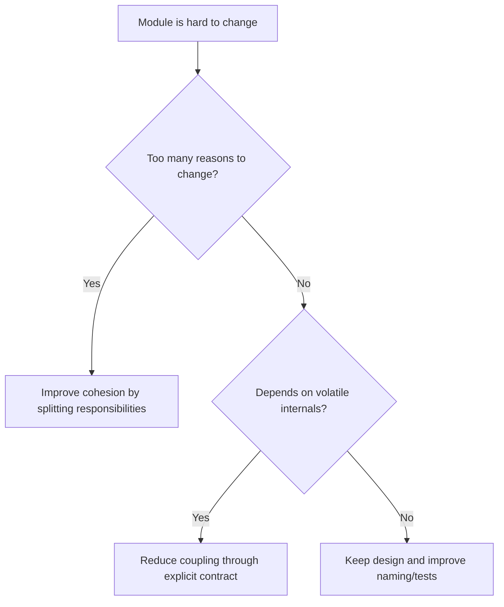

# High Cohesion and Low Coupling

High cohesion means related behavior and data live together. Low coupling means
components depend on stable contracts rather than volatile implementation
details.

## Philosophy

Cohesion and coupling are the core forces behind maintainable architecture. A
system with high cohesion is easier to name and test. A system with low harmful
coupling is easier to change safely.

The target is not zero coupling. Useful software requires collaboration. The
target is intentional coupling through explicit, stable boundaries.

## Explanation

High cohesion signals:

- a module has one clear purpose;
- names come from domain or operational language;
- tests for the module focus on one kind of behavior;
- changes to the module share a reason.

Harmful coupling signals:

- one change forces edits across unrelated modules;
- callers know another component's internals;
- framework or persistence details leak inward;
- import cycles or service locators hide dependency direction.

## Bad Example

```python
class JobHelper:
    def parse_cron(self): ...
    def upload_to_s3(self): ...
    def create_invoice(self): ...
    def render_http_error(self): ...
```

The class has unrelated responsibilities and will change for unrelated reasons.

## Good Example

```python
class BackupSchedule:
    def next_run_after(self, instant: datetime) -> datetime:
        ...


class BackupStorage:
    async def store(self, artifact: BackupArtifact) -> StoredArtifact:
        ...
```

Each concept has a clear owner.

## Decision Tree



## AI Guidance

- Diagnose cohesion before introducing interfaces.
- Split by reason to change, not by arbitrary file size.
- Prefer stable contracts at architecture boundaries.
- Avoid shared utility modules that collect unrelated behavior.
- Treat shotgun surgery as evidence of missing ownership.

## Review Checklist

- Modules have clear, narrow purposes.
- Collaborators communicate through stable contracts.
- Changes are localized to the owning concept where practical.
- No circular dependency or hidden lookup is introduced.
- Tests can exercise cohesive behavior without full-system setup.

## References

- Tight Coupling: `../anti-patterns/tight-coupling.md`
- God Class: `../smells/god-class.md`
- Shotgun Surgery: `../smells/shotgun-surgery.md`
- SOLID: `solid.md`
