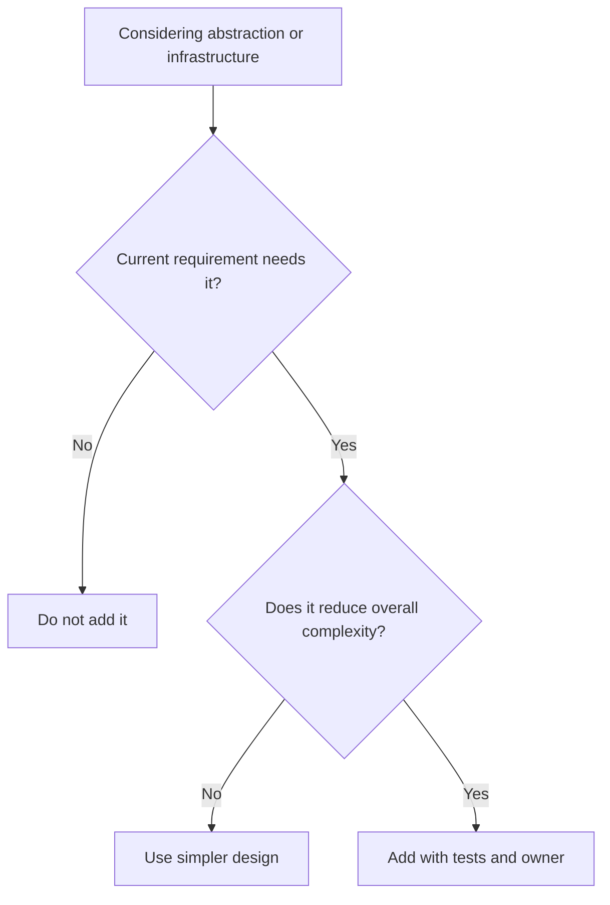

# KISS

KISS means prefer the simplest design that satisfies the goal, constraints,
quality attributes, and known extension points.

## Philosophy

Simple systems are easier to reason about, test, secure, operate, and modernize.
Complexity is justified only when it pays for a real requirement or reduces a
larger risk. AI agents must be especially cautious: generating more structure is
easy, but maintaining it is expensive.

Simplicity is not minimalism at any cost. A small amount of explicit structure
can simplify the whole system when it clarifies boundaries and ownership.

## Explanation

KISS favors:

- direct domain language;
- explicit dependencies;
- narrow interfaces;
- small cohesive modules;
- ordinary control flow;
- framework features used in their intended place;
- tests that explain behavior.

KISS rejects:

- speculative plugin systems;
- generic abstractions without current variation;
- inheritance hierarchies for simple branching;
- hidden global registries;
- clever metaprogramming;
- premature caching, queuing, or distribution.

## Bad Example

```python
class RuleEngine:
    def execute(self, rule_name: str, payload: dict) -> dict:
        rule = self._container.resolve(rule_name)
        return rule.apply(payload)
```

If the system has two stable validation rules, this engine adds indirection
without value.

## Good Example

```python
def validate_backup_retention(days: int) -> None:
    if days < 1 or days > 365:
        raise ValueError("retention must be between 1 and 365 days")
```

The direct function is enough until real variation appears.

## Decision Tree



## AI Guidance

- Start with the simplest design that meets acceptance criteria.
- Add abstractions only when they clarify ownership, reduce real duplication, or
  isolate volatility.
- Do not introduce new frameworks to avoid writing a small amount of clear code.
- Prefer boring Python over clever dynamic behavior.

## Review Checklist

- The design directly satisfies the goal without speculative features.
- Each abstraction has a current reason to exist.
- The simplest error, transaction, and dependency model is used.
- Complexity is documented where unavoidable.
- Tests remain readable and focused on behavior.

## References

- YAGNI: `yagni.md`
- Service Locator: `../anti-patterns/service-locator.md`
- Singleton Abuse: `../anti-patterns/singleton-abuse.md`
- Long Method: `../smells/long-method.md`
