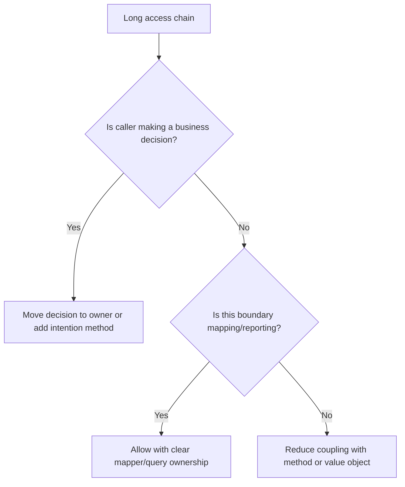

# Law of Demeter

The Law of Demeter says a component should talk to its immediate collaborators,
not reach through them into deeper object graphs.

## Philosophy

Long access chains expose internal structure. They make callers depend on how a
collaborator is built instead of what it can do. This increases coupling and
often reveals misplaced behavior.

The goal is not to ban all nested data access. The goal is to protect
encapsulation where behavior and invariants matter.

## Explanation

Warning signs:

- `order.customer.account.status`;
- callers navigating ORM relationships to make domain decisions;
- tests asserting through deep internal paths;
- services that assemble decisions from another object's private structure.

Acceptable cases:

- simple immutable DTO projection at a boundary;
- serialization code that intentionally maps nested data;
- reporting queries that do not own domain behavior.

## Bad Example

```python
if order.customer.account.status == "blocked":
    raise ValueError("customer is blocked")
```

The caller knows the internal path to account status.

## Good Example

```python
if order.customer_is_blocked():
    raise ValueError("customer is blocked")
```

The decision is expressed through the owning object.

## Decision Tree



## AI Guidance

- Treat long chains as feature envy candidates.
- Add intention-revealing methods when they protect invariants.
- Do not hide data access behind meaningless pass-through methods.
- Keep DTO mapping explicit at boundaries.

## Review Checklist

- Business rules do not depend on deep object structure.
- Intention-revealing methods replace fragile chains where useful.
- Boundary mappers are clearly separated from domain decisions.
- Tests use public behavior rather than internals.
- Refactors improve encapsulation without bloating objects.

## References

- Feature Envy: `../smells/feature-envy.md`
- Tell, Don't Ask: `tell-dont-ask.md`
- Tight Coupling: `../anti-patterns/tight-coupling.md`
- Domain Entities: `../domain/entities.md`
