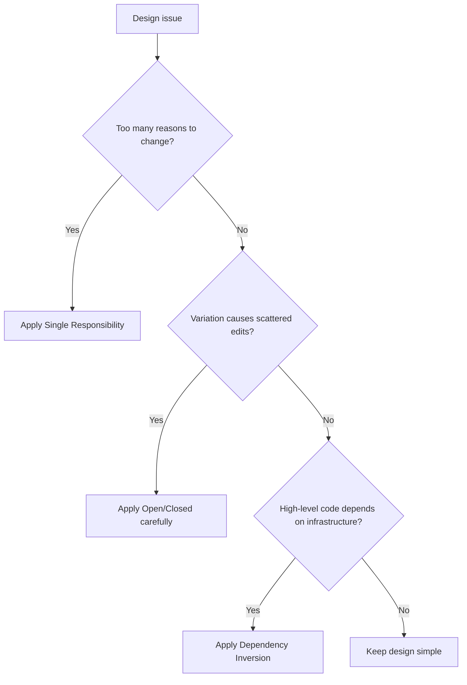

# SOLID

SOLID is a set of object-oriented design principles used to keep modules
cohesive, replaceable, and safe to change. In AI-OS work, SOLID is applied
pragmatically, not ceremonially.

## Philosophy

SOLID helps agents reason about responsibilities and dependencies. It is not a
license to add interfaces everywhere. The goal is changeable code with explicit
ownership and stable boundaries.

## Principles

### Single Responsibility

A module, class, or function should have one primary reason to change.

Bad:

```python
class UserService:
    def validate_user(self): ...
    def save_to_database(self): ...
    def send_email(self): ...
    def render_response(self): ...
```

Good:

```python
class RegisterUserService:
    def __init__(self, users: UserRepository, email: EmailGateway) -> None:
        self._users = users
        self._email = email
```

### Open/Closed

Code should be open for required extension and closed to repeated modification
of stable policy.

Use strategy or adapter when real variation exists. Do not create plugin systems
for imaginary variation.

### Liskov Substitution

A subtype or implementation must honor the contract expected by callers. It
must not weaken guarantees, change units, hide side effects, or throw unrelated
exceptions.

### Interface Segregation

Prefer small role-specific protocols over broad interfaces that force
implementations to provide unused behavior.

### Dependency Inversion

High-level policy should depend on abstractions it owns, not low-level
infrastructure details.

## Decision Tree



## AI Guidance

- Use SOLID to diagnose concrete change risk, not to force patterns.
- Prefer protocols at boundaries with volatility or side effects.
- Avoid one-method interfaces when a simple function is clearer.
- Check Liskov by asking whether all implementations preserve caller
  expectations under error cases.

## Review Checklist

- Classes and modules have clear reasons to change.
- Variation points are explicit only where real variation exists.
- Interfaces are small and client-specific.
- Implementations preserve contracts.
- High-level policy does not depend on infrastructure details.
- SOLID improvements do not violate KISS or YAGNI.

## References

- God Class: `../smells/god-class.md`
- Shotgun Surgery: `../smells/shotgun-surgery.md`
- Dependency Injection: `dependency-injection.md`
- Architecture Constitution: `../architecture/constitution.md`
