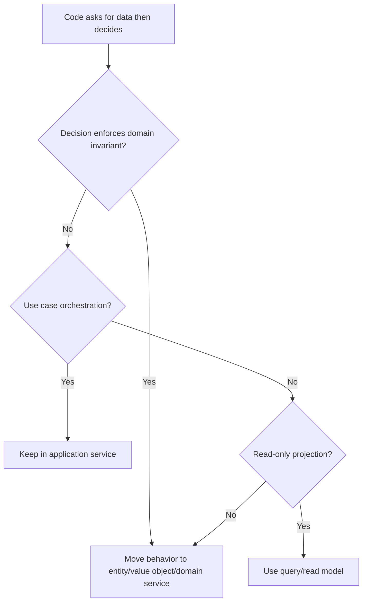

# Tell, Don't Ask

Tell, Don't Ask means asking objects to perform behavior rather than extracting
their data and making decisions elsewhere.

## Philosophy

Objects should protect their own invariants. When outside code repeatedly asks
for data and then decides what the object should do, behavior drifts away from
the data it governs. This leads to feature envy, duplicated rules, and anemic
domain models.

Use the principle pragmatically. Application services may coordinate use cases,
and query models may expose data for reporting. The smell appears when domain
decisions are made outside the domain owner.

## Explanation

Ask-style code:

- gets several fields;
- branches on them externally;
- mutates the object based on the branch.

Tell-style code:

- names the domain operation;
- lets the owner enforce preconditions;
- keeps invariants in one place.

## Bad Example

```python
if backup.status == "running" and backup.started_at < cutoff:
    backup.status = "failed"
    backup.failed_reason = "timeout"
```

External code knows status rules and mutates internals.

## Good Example

```python
backup.fail_if_timed_out(cutoff)
```

The entity owns the state transition and invariant.

## Decision Tree



## AI Guidance

- Move behavior to the owner of the invariant.
- Avoid turning entities into persistence bags with public mutable fields.
- Keep application services as orchestrators, not rule containers.
- Do not force reporting code into domain objects when it is purely projection.

## Review Checklist

- Domain state transitions are named operations.
- Invariants are enforced by domain owners.
- External code does not mutate internal state directly.
- Application services coordinate collaborators without duplicating rules.
- Query/read models are separated from command behavior.

## References

- Feature Envy: `../smells/feature-envy.md`
- Primitive Obsession: `../smells/primitive-obsession.md`
- Domain Invariants: `../domain/invariants.md`
- Law of Demeter: `law-of-demeter.md`
