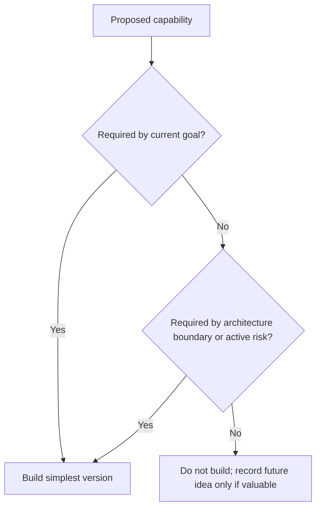

# YAGNI

YAGNI means do not build capabilities until there is a demonstrated need.

## Philosophy

Legacy systems often contain unused extension points, abandoned compatibility
paths, speculative settings, and framework layers created for futures that never
arrived. YAGNI protects modernization from adding the next generation of dead
weight.

YAGNI does not forbid designing for change. It requires that change pressure be
real, named, and worth the complexity.

## Explanation

Avoid building:

- generic plugin architectures without active variation;
- repository abstractions for pure in-memory logic;
- distributed queues for synchronous workflows that meet performance goals;
- configuration flags without owner and review trigger;
- extra API versions before compatibility requires them;
- unused base classes and hooks.

Build now when:

- acceptance criteria require it;
- current risk demands it;
- multiple real use cases already exist;
- removing the capability later would be more expensive than adding it now;
- the Architecture Constitution requires a boundary.

## Bad Example

```python
class BackupProviderPlugin(Protocol):
    def before_validate(self) -> None: ...
    def after_validate(self) -> None: ...
    def before_upload(self) -> None: ...
    def after_upload(self) -> None: ...
```

If there is one provider and no known extension requirement, the plugin surface
is speculative.

## Good Example

```python
class BackupStorage(Protocol):
    async def store(self, artifact: BackupArtifact) -> StoredArtifact: ...
```

This boundary is justified when production supports multiple storage adapters or
needs to isolate external I/O.

## Decision Tree



## AI Guidance

- Treat "we might need it later" as insufficient.
- Preserve a clear path to change without implementing the change early.
- Remove speculative code when evidence shows it is unused.
- Record deferred ideas in roadmap only when they are tied to a real trigger.

## Review Checklist

- Every new capability maps to a goal, constraint, or active risk.
- Extension points have current variation or clear ownership.
- Flags and settings have owners and removal criteria.
- Dead code and unused hooks are removed.
- The design remains easy to change without carrying unused behavior.

## References

- Dead Code: `../smells/dead-code.md`
- KISS: `kiss.md`
- Architecture Constitution: `../architecture/constitution.md`
- Project Brain Roadmap: `../brain/roadmap.md`
