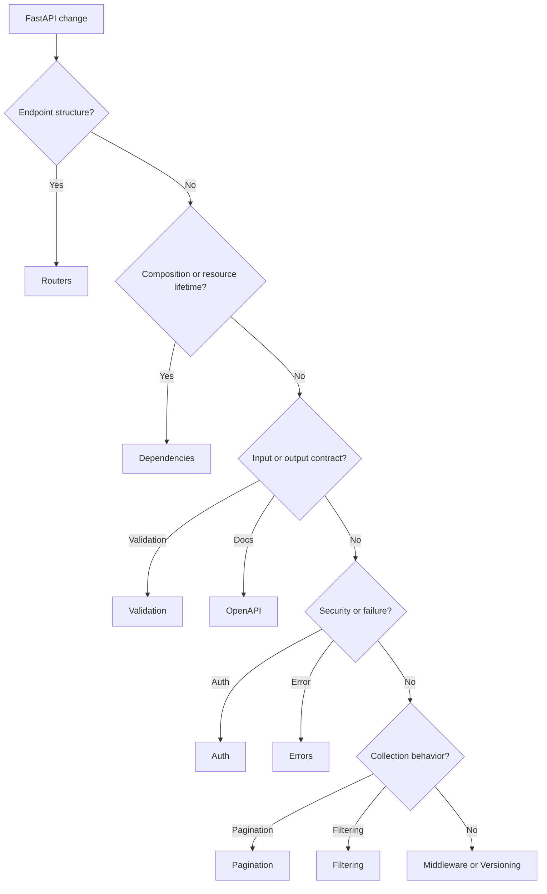

# FastAPI Standards Index

FastAPI standards define HTTP boundary behavior for AI-OS services. FastAPI is a
transport adapter: it validates requests, composes dependencies, authorizes
access, calls application services, maps responses, and documents API contracts.

## Use This Index

Use this page when implementing or reviewing routes, dependencies, validation,
errors, authentication, pagination, filtering, OpenAPI metadata, middleware, or
versioning.

## Severity Model

| Severity | Meaning | Required Action |
| --- | --- | --- |
| Critical | Issue exposes data, bypasses auth, leaks secrets, breaks compatibility, or corrupts state. | Block completion or require formal exception. |
| High | Issue puts business logic in transport, leaks internals, weakens validation, or creates unobservable failures. | Fix in current phase or record owned debt. |
| Medium | Issue reduces API consistency, discoverability, or maintainability. | Fix opportunistically or schedule targeted work. |
| Low | Local style or naming inconsistency. | Improve under Boy Scout Rule when safe. |

## Standards Catalog

| Standard | Use When | Common Findings |
| --- | --- | --- |
| [Routers](routers.md) | Designing endpoint functions and route modules. | Business logic in routes, ORM leakage |
| [Dependencies](dependencies.md) | Composing services and resources at HTTP edge. | Service locator usage, hidden state |
| [Validation](validation.md) | Validating requests and path/query/body inputs. | Weak schemas, duplicated validation |
| [Errors](errors.md) | Mapping application failures to HTTP responses. | Stack trace leakage, inconsistent shape |
| [Auth](auth.md) | Authentication and authorization. | Missing server-side checks |
| [Pagination](pagination.md) | Returning collections. | Unbounded queries, unstable ordering |
| [Filtering](filtering.md) | Query filters and search inputs. | Unsafe dynamic queries |
| [OpenAPI](openapi.md) | API documentation and contract metadata. | Missing response models or examples |
| [Middleware](middleware.md) | Cross-cutting HTTP concerns. | Business logic in middleware |
| [Versioning](versioning.md) | Compatibility and API evolution. | Breaking changes without version plan |

## Routing Decision Tree

## AI Guidance

- Keep HTTP concerns at the edge and business behavior in application services.
- Use Pydantic v2 schemas for request and response contracts.
- Treat authorization as a server-side application rule, not UI behavior.
- Do not leak ORM models, stack traces, secrets, or infrastructure exceptions.

## References

- FastAPI Python Usage: `../python/fastapi.md`
- Pydantic v2: `../python/pydantic-v2.md`
- Architecture Constitution: `../architecture/constitution.md`
- Code Review: `../checklists/code-review.md`
