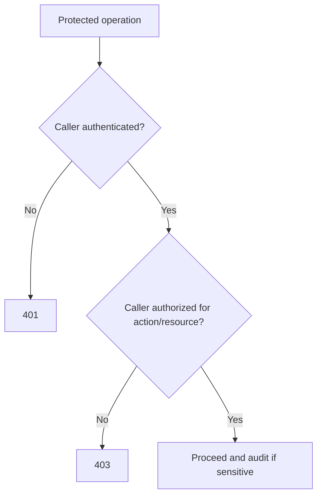

# FastAPI Auth

Authentication proves who the caller is. Authorization decides what the caller
may do. Both are server-side responsibilities.

## Philosophy

Security controls belong in the service, not in clients or documentation.
FastAPI dependencies can identify the caller at the edge, but application logic
must still enforce business authorization rules where needed.

## Rules

- Authenticate callers before protected operations.
- Enforce authorization server-side for every protected use case.
- Do not trust user IDs, tenant IDs, or roles supplied only by request body.
- Keep security dependencies explicit.
- Return safe, consistent 401 and 403 responses.
- Audit security-sensitive actions.

## Bad Example

```python
@router.delete("/users/{user_id}")
async def delete_user(user_id: str):
    await service.delete(user_id)
```

## Good Example

```python
@router.delete("/users/{user_id}", status_code=204)
async def delete_user(
    user_id: str,
    principal: Principal = Depends(require_authenticated_user),
    service: DeleteUserService = Depends(get_delete_user_service),
) -> None:
    await service.delete(DeleteUserCommand(user_id=user_id, requested_by=principal))
```

## Decision Tree



## AI Guidance

- Treat missing authorization as critical.
- Prefer explicit policy checks over scattered role string comparisons.
- Never log credentials or bearer tokens.

## Review Checklist

- Protected endpoints require authentication.
- Authorization checks include resource ownership or tenant boundaries.
- 401 and 403 behavior is consistent.
- Sensitive actions are audited.
- Tests cover denied and allowed cases.

## References

- Security Engineer: `../agents/security.md`
- FastAPI Dependencies: `dependencies.md`
- Security Review: `../checklists/security-review.md`
