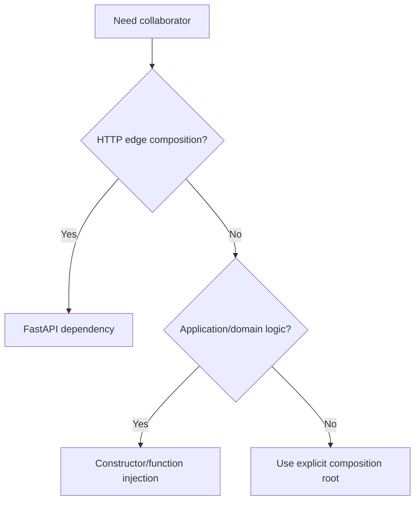

# FastAPI Dependencies

FastAPI dependencies compose request-scoped resources and application services at
the HTTP edge. They must not become a service locator for core logic.

## Philosophy

Dependency wiring belongs at composition roots. FastAPI's `Depends` is useful
for HTTP composition, but domain and application services should receive normal
constructor or function arguments.

## Rules

- Use dependencies for auth context, request-scoped sessions, settings, and
  service construction.
- Do not call `Depends` or dependency provider functions inside domain logic.
- Keep resource lifetimes explicit.
- Cache only immutable or lifespan-managed resources.
- Do not hide business decisions in dependency providers.

## Bad Example

```python
class JobService:
    def run(self) -> None:
        settings = get_settings()
        repository = get_repository()
```

## Good Example

```python
def get_job_service(
    repository: JobRepository = Depends(get_job_repository),
    clock: Clock = Depends(get_clock),
) -> JobService:
    return JobService(repository=repository, clock=clock)
```

## Decision Tree



## AI Guidance

- Keep dependency providers small and named by what they provide.
- Do not use dependency functions as global getters.
- Prefer fakes in tests over patching providers deep in logic.

## Review Checklist

- Dependencies are limited to edge composition.
- Resource cleanup and session scope are clear.
- No service locator pattern is introduced.
- Providers do not contain business workflows.
- Tests can replace dependencies explicitly.

## References

- Dependency Injection: `../engineering/dependency-injection.md`
- Service Locator: `../anti-patterns/service-locator.md`
- SQLAlchemy 2.x: `../python/sqlalchemy2.md`
