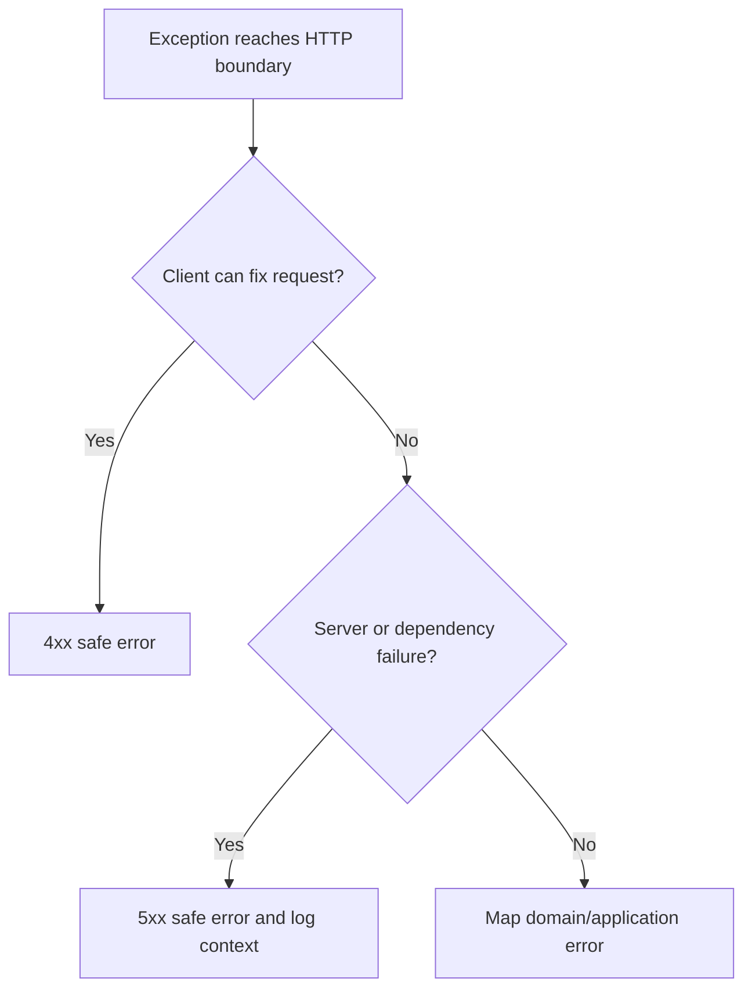

# FastAPI Errors

FastAPI error handling translates application failures into safe, consistent
HTTP responses.

## Philosophy

Clients need stable error contracts. Operators need diagnostic context. Attackers
must not receive stack traces, secrets, SQL, or infrastructure details.

## Rules

- Use consistent error response shapes.
- Translate domain and application exceptions at the HTTP boundary.
- Preserve internal exception chains in logs where safe.
- Do not expose stack traces or infrastructure messages to clients.
- Use appropriate status codes.
- Include correlation or request identifiers when available.

## Bad Example

```python
except Exception as exc:
    raise HTTPException(status_code=500, detail=str(exc))
```

## Good Example

```python
@app.exception_handler(BackupNotFound)
async def backup_not_found_handler(request: Request, exc: BackupNotFound) -> JSONResponse:
    return JSONResponse(
        status_code=404,
        content={"error": {"code": "backup_not_found", "message": "Backup was not found"}},
    )
```

## Decision Tree



## AI Guidance

- Do not turn all failures into HTTP 500.
- Do not leak exception messages from infrastructure.
- Log diagnostic context separately from client response.

## Review Checklist

- Error shape is consistent.
- Status codes match failure category.
- Sensitive details are not exposed.
- Important failures are logged with safe context.
- Tests cover representative error mappings.

## References

- Exceptions: `../python/exceptions.md`
- Logging: `../python/logging.md`
- Security Engineer: `../agents/security.md`
