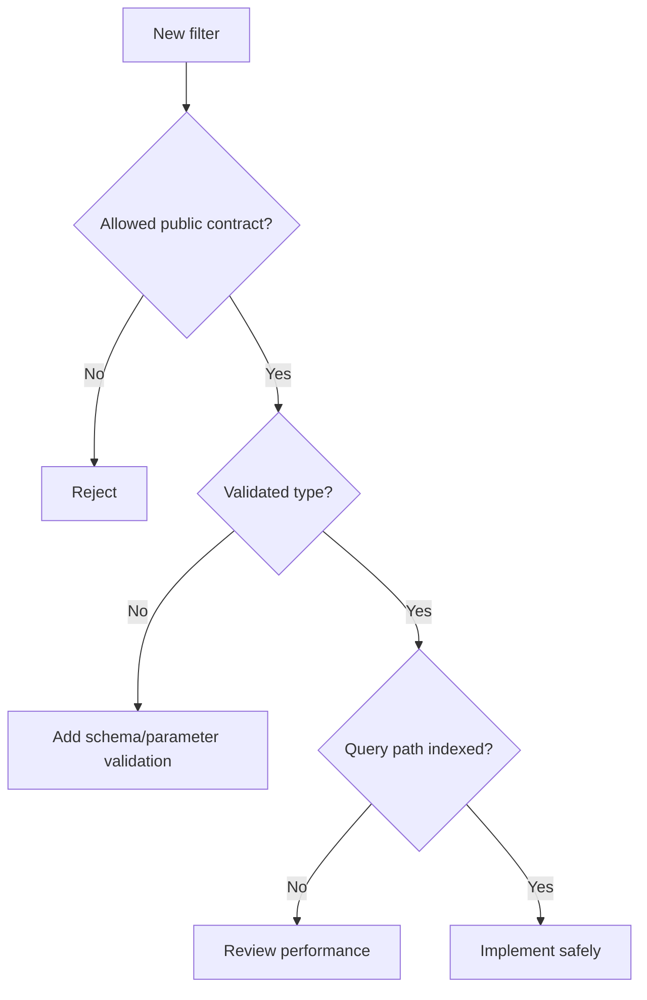

# FastAPI Filtering

Filtering lets clients narrow collection results through safe, validated query
parameters.

## Philosophy

Filtering is an API contract and a database access pattern. Unsafe dynamic
filters can create security, performance, and compatibility problems.

## Rules

- Define allowed filter fields explicitly.
- Validate filter values with Pydantic or typed parameter objects.
- Do not pass raw query strings into SQL.
- Keep filter semantics documented and stable.
- Combine filtering with pagination and stable ordering.
- Review indexes for common filters.

## Bad Example

```python
@router.get("/jobs")
async def list_jobs(where: str):
    return session.execute(text(f"select * from jobs where {where}"))
```

## Good Example

```python
class JobFilter(BaseModel):
    status: JobStatus | None = None
    created_after: datetime | None = None


@router.get("/jobs")
async def list_jobs(filters: JobFilter = Depends()) -> Page[JobResponse]:
    return await service.list_jobs(filters)
```

## Decision Tree



## AI Guidance

- Never build SQL from raw query strings.
- Keep filter objects explicit and small.
- Document whether filters are exact, partial, case-sensitive, or range-based.

## Review Checklist

- Allowed filters are explicit.
- Values are typed and validated.
- Query construction is safe.
- Pagination and ordering are compatible with filters.
- Index impact is considered.

## References

- Pagination: `pagination.md`
- Validation: `validation.md`
- SQLAlchemy 2.x: `../python/sqlalchemy2.md`
