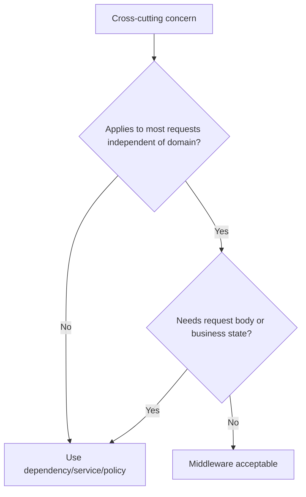

# FastAPI Middleware

Middleware handles cross-cutting HTTP concerns around requests and responses.
It must remain infrastructure-level and must not contain business logic.

## Philosophy

Middleware is powerful because it runs across many requests. That also makes it
risky. It should handle concerns that are truly cross-cutting and independent of
specific domain use cases.

## Rules

- Use middleware for request IDs, tracing, CORS, compression, timing, and safe
  security headers.
- Do not put authorization policy, domain decisions, or persistence workflows in
  middleware.
- Keep middleware order intentional.
- Avoid reading request bodies unless necessary.
- Ensure middleware is observable and failure-safe.

## Bad Example

```python
@app.middleware("http")
async def block_unpaid_customers(request: Request, call_next):
    if await customer_is_unpaid(request):
        return JSONResponse(status_code=403, content={...})
    return await call_next(request)
```

## Good Example

```python
@app.middleware("http")
async def add_request_id(request: Request, call_next):
    request_id = request.headers.get("x-request-id") or generate_request_id()
    response = await call_next(request)
    response.headers["x-request-id"] = request_id
    return response
```

## Decision Tree



## AI Guidance

- Treat middleware as infrastructure.
- Keep domain authorization in dependencies or application policy.
- Document middleware order when it matters.

## Review Checklist

- Middleware concern is truly cross-cutting.
- No business logic or persistence workflow is present.
- Order and failure behavior are clear.
- Sensitive data is not logged.
- Tests cover important headers or behavior.

## References

- Logging: `../python/logging.md`
- Auth: `auth.md`
- Architecture Constitution: `../architecture/constitution.md`
